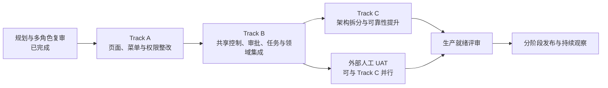

# PR192 房产业务产品化整改执行路线图

## 1. 文档用途

本文档面向产品负责人、业务负责人、项目管理人员、设计与研发团队、测试人员、运营
人员和岗位用户代表，用来共同查看整改工作目前走到哪里、下一步做什么、由谁参与、
什么条件下才算完成。

本文档是执行进度入口，不代替详细需求、技术设计、测试报告或审批记录。需要了解
具体规则时，可查阅同目录下的
[产品需求](./prd.md)、[技术设计](./design.md)、
[实施计划](./implement.md) 和 [评审门禁](./review-gates.md)。

## 2. 更新规则

- 每周至少更新一次；阶段状态变化、出现阻塞或形成重要决定时应当天更新。
- 状态只使用：`未开始`、`进行中`、`已完成`、`阻塞`。
- 没有可复查证据时，不得把阶段标记为“已完成”。
- “技术完成”和“生产就绪”必须分开记录。Codex 可以完成设计、开发、自动测试和
  技术证据，但不能代替真实岗位用户、业务、财务、安全或生产负责人签署。
- 每次更新应填写计划日期、实际日期、证据链接，并在周进展记录中说明变化。
- 发生依赖变化、范围变化或重要取舍时，同时登记到“风险、决策与阻塞记录”。
- 日期统一使用 `YYYY-MM-DD`；尚未确定时填写“待排期”，尚未发生时填写“—”。

## 3. 总体阶段图



通俗地说：先把页面、菜单和权限边界理顺，再补齐共享控制、审批与任务能力，然后
改善内部架构、弱网使用和运行可靠性。真实用户验收在 Track B 技术通过后开始，可与
Track C 并行；只有技术整改和人工验收都通过，才进入生产就绪。

## 4. 当前状态

| 项目 | 当前状态 | 说明 |
|---|---|---|
| 总体规划与多角色复审 | 已完成 | 已形成父任务、11 个规划子任务、阶段依赖、负责人边界和验收门禁 |
| 开发分支与任务登记 | 已完成 | 已建立本次整改分支和 Trellis 任务结构 |
| Track A 合同实现 | 进行中 | contract/server-safety baseline=`e709459a034807b3575db604a76bc69bf1c5ff5b`；A-C2 migration+API projection slice runtime Gate PASS；后置 Web 交付尚未完成 |
| 业务页面整改 | 未开始 | 尚未开始民宿和住房 canonical 页面拆分 |
| 自动化验收执行 | 进行中 | A-C1/A-server-safety 与 A-C2 migration+API projection slice Gate 已通过；页面和最终 E2E Gate 尚未执行 |
| 外部人工 UAT | 未开始 | 等待 Track B 技术通过和隔离验收环境 |
| 生产就绪 | 未开始 | 必须等待 Track A、B、C 技术结果和人工签署 |

当前结论：**A-server-safety stop-ship 已关闭，contract/server-safety baseline
已于 2026-07-30 冻结为 `e709459a034807b3575db604a76bc69bf1c5ff5b`；A-C2
migration+API-only projection slice runtime Gate 已通过，但 A-1 仍未完成。A-base
S0 发现的 bootstrap P1 已由独立 checker 关闭，正式 handoff SHA 为
`b734460703f061feecd5a4fac60a6ee8aad9771cd4ea4a9413d2fa60d27f6268`。
Shared Web foundation commit
`d2a015f9ba931b2024e6360570697c77b74ea3fb` 也已冻结。A-base-core 已基于
`32ccc02852c3201c6f68e3b6b89e4398cb102a17` provisioned，fixture handoff
`3cb78fe3b7d1d69490bc028f4da460d2fe4d0673f9eb7e13f6a6f47de10eb87c`
已冻结。下一动作是 A-2.5，再交付两个领域 route SHA。任何 workbench Web 必须等待
A-2.5，Web menu 还必须等待真实 route SHA，
不得提前把 A-1 标记完成。**

## 5. Track A：页面、菜单与权限整改

Track A 的目标是先把民宿与住房出租拆成清晰、可授权、可单独进入的工作页面，同时
保持现有业务能力可用。它不等待 Track B 的身份、审批和任务运行时。

### 5.1 详细执行顺序

| 阶段 | 状态 | 负责人 / 参与角色 | 前置条件 | 完成标准 | 证据链接 | 计划日期 | 实际日期 |
|---|---|---|---|---|---|---|---|
| A-0 启动确认 | 已完成 | 项目负责人；产品、架构、研发、测试代表 | 多角色复审结论已通过 | 分支、父任务、11 个子任务、唯一负责人边界和停工条件均已登记；这只代表规划启动完成 | [父任务资料](./) | 2026-07-30 | 2026-07-30 |
| A-1 合同与权限基础 | 已完成 | 共享合同、server safety、民宿/住房 API、环境文档、API menu projection、数据库变更负责人；产品与安全参与 | A-0 完成 | shared、RBAC、17/7 routes、Party target 与 DB evidence 全部闭合，open_P0_P1=[] | [合同与权限任务](../07-30-pr192-a-contract-rbac-foundation/) | 2026-07-30 | 2026-07-31 |
| A-2 共享界面基础 | 机器 Gate 已完成 / 浏览器待验 | 共享房产 Web 负责人持组件；domain route owner 持浏览器执行；QA 持证据 | A-1 的访问与响应合同已冻结 | 双域已消费同一 foundation；仅 Chrome connector sandboxCwd 阻塞真实浏览器证据 | [共享界面 handoff](../07-30-pr192-a-shared-web-foundation/) | 2026-07-30 | 机器 Gate 2026-07-31 |
| A-2.5 Workbench API/response contract closure | 已完成 / 非 release-ready | shared-contract、homestay-api、housing-api、schema-migration、asset-party owners；独立 checker | A-base handoff | 全 response/GET/field/file contracts、7 detail routes、9 high-risk、Party target 闭合；open_P0_P1=[] | `3766509`/`44d6769`/`8a0bd17`/`5a557e5`/`d33fad9` | 2026-07-31 | 2026-07-31 |
| A-3 民宿与住房工作台并行整改 | 机器 Gate 已完成 / 浏览器待验 | 民宿 Web 负责人、住房 Web 负责人；产品、UI、交互、测试与岗位代表参与 | A-2.5 PASS | 双域工作台已交付；Chrome connector sandboxCwd 恢复后补 desktop/390/keyboard/zoom evidence | [民宿](../07-30-pr192-a-homestay-workbenches/)；[住房](../07-30-pr192-a-housing-workbenches/) | 2026-07-31 | 机器 Gate 2026-07-31 |
| A-4 Web 菜单、落地页与深链防护 | 已完成 | 菜单权限负责人；住房 route owner 持有 tenant alias；民宿 route owner 参与 | A-3 两份 canonical route SHA | Web menu、legacy landing、Party alias 与 unknown deep-link fail-closed 已进入 integration Gate | `d33fad9`、`bc2ed7f`、`992a6a4` | 2026-07-31 | 2026-07-31 |
| A-5 自动验收与独立复审 | 机器 Gate PASS / 浏览器基础设施阻塞 | 自动化测试负责人；独立的产品、权限、UX、测试审查者 | A-base 与 routes 已完成 | API 91/91、Web default tsc/lint/build154、DB evidence、open_P0_P1=[]；真实视觉证据待 connector | [Track A 自动验收证据](../07-30-pr192-a-automated-gates/) | 2026-07-30 | 2026-07-31 |

### 5.2 Track A 放行原则

- A-1 与 A-2.5 已完成；A-base-core 已 provisioned。
- A-1 内部顺序固定为：A-contract candidate → A-server-safety/field-projection Gate
  → 最终 A-contract SHA → schema migration/exact tests → API-only `/users/me`
  projection。Web menu 不属于此时的可见交付。
- A-2 达到 `foundation handoff ready` 后，民宿和住房负责人可以研究共享组件的
  消费方式；任何 workbench Web 文件仍不得开始。首个 domain route 负责补真实
  浏览器证据，final UI Gate 在证据补齐后完成，禁止 preview/生产 route。
- A-base handoff 已冻结；A-2.5 已解除依赖并作为下一步串行 Gate。合同研究可先行，
  workbench Web 必须等待 `A-2.5-contract-closure SHA`。
- A-3 先交付实际页面地址，A-4 再建立菜单、落地页和跳转，避免菜单指向不存在或
  尚未验收的页面。
- A-4 只能消费 homestay/housing route SHA；domain Web owners 保持各自 app
  routes/guards ownership，menu owner 不创建 route。
- A-5 通过只代表 Track A 技术通过，不代表高风险审批动作可在生产启用。

## 6. Track B：共享控制、审批、任务与领域集成

Track B 在 Track A 技术通过后进行，补齐共享房产控制面、身份资料、审批执行、任务
分配以及民宿和住房的领域集成。各部分分开交付，避免把多个运行时混成一个不可审查
的大改动。

| 阶段 | 状态 | 负责人 / 参与角色 | 前置条件 | 完成标准 | 证据链接 | 计划日期 | 实际日期 |
|---|---|---|---|---|---|---|---|
| B-0 合同与数据库扩展 | 未开始 | 共享合同负责人、数据库变更负责人、架构审查者 | Track A 技术通过 | 身份、审批、任务和消息合同冻结；数据库只做向前兼容扩展；迁移编号、重跑和校验通过 | 待补：B 合同与数据库证据 | 待排期 | — |
| B-0.5 共享房产与模块基础 | 未开始 | 共享房产 API 负责人、模块依赖负责人；安全与产品参与 | B-0 完成 | 共享房产控制、Party/身份基础和模块依赖可独立验证；缺少前置模块时安全拒绝 | [待补：身份与控制面证据](../07-30-pr192-b-identity-control-plane/) | 待排期 | — |
| B-1 审批运行时核心 | 未开始 | 审批运行时负责人；财务、安全、架构和故障测试参与 | B-0 完成；共享房产接口稳定 | 决策与执行状态清晰；经办人与审批人分离；崩溃、重试和重复消息不会造成重复业务或财务结果；单独形成审批运行时交付 | [待补：审批运行时证据](../07-30-pr192-b-approval-runtime-tasks/) | 待排期 | — |
| B-2a 任务运行时核心 | 未开始 | 房产任务负责人；审批、领域和并发测试参与 | B-1 审批运行时已交付 | 任务领取只有一个成功者；列表和数量一致；任务视图可重建且不覆盖业务状态；单独形成任务运行时交付 | [待补：任务运行时证据](../07-30-pr192-b-approval-runtime-tasks/) | 待排期 | — |
| B-2b B 扩展测试数据 | 未开始 | 自动化测试负责人、迁移核对负责人 | 共享房产、审批和任务三个运行时均已交付；模块基础完成 | 生成可重复的 B 扩展测试数据和校验值；未改变 Track A 基础数据；清理和重跑通过 | 待补：B-extension 数据与校验证据 | 待排期 | — |
| B-2c 民宿与住房领域接入 | 未开始 | 民宿 API 负责人、住房 API 负责人、最终装配负责人 | B-2b 完成 | 民宿入住、住房租赁、财务和采购等高风险动作接入统一审批与任务能力；业务结果只发生一次；应用可正常启动 | [待补：领域集成证据](../07-30-pr192-b-domain-integrations/) | 待排期 | — |
| B-3 领域 Web 集成 | 未开始 | 共享房产、民宿、住房 Web 负责人；UI、交互、测试参与 | B-2c 完成 | 原有正式页面中能查看身份、审批、任务和执行结果；不新增重复页面或第二套流程；权限仍然隔离 | [待补：B Web 集成证据](../07-30-pr192-b-domain-integrations/) | 待排期 | — |
| B-4 迁移、核对与恢复演练 | 未开始 | 迁移核对、自动化测试、兼容性测试负责人 | B-3 完成并形成领域交付 | 旧数据迁移前后零差异；崩溃、重复、乱序、回滚和重新启用均通过；输出最终核对证据 | [待补：迁移与核对证据](../07-30-pr192-b-integration-reconcile/) | 待排期 | — |
| B-5 Track B 技术验收 | 未开始 | 独立安全、财务、架构审查者 | B-0 至 B-4 完成 | 身份、审批、任务、财务一次性、兼容和恢复全部通过；无未关闭 P0/P1；形成 Track B 技术交付 | 待补：Track B 技术验收报告 | 待排期 | — |

Track B 技术通过后，高风险生产开关仍保持关闭，直到外部人工 UAT 和生产就绪评审
完成。

## 7. Track C：架构与可靠性

Track C 只依赖 Track B 的技术交付，不等待人工 UAT。它以不改变已有业务行为为前提，
改善代码边界、页面稳定性、手机与弱网体验、上传队列、性能和可回退性。

| 阶段 | 状态 | 负责人 / 参与角色 | 前置条件 | 完成标准 | 证据链接 | 计划日期 | 实际日期 |
|---|---|---|---|---|---|---|---|
| C-0 接管确认与现状基线 | 未开始 | 架构负责人、民宿/住房原负责人、共享 Web 负责人、测试 | Track B 技术交付；相关路径完成明确交接 | 每个改动路径只有一个负责人；原负责人停止写入后才接管；现有行为和已知问题均有记录 | [待补：接管记录](../07-30-pr192-c-architecture-reliability/) | 待排期 | — |
| C-1 后端职责拆分 | 未开始 | 民宿、住房后端负责人；架构和回归测试参与 | C-0 完成 | 对外接口和业务结果不变；重复依赖和双写被移除；每个小批次可独立回退 | 待补：后端拆分与回归证据 | 待排期 | — |
| C-2 前端、弱网与上传可靠性 | 未开始 | 民宿、住房前端负责人、可靠性负责人；现场用户代表参与 | C-0 完成；共享离线路径完成专门交接 | 草稿按用户和园区隔离并按期清理；敏感资料不离线保存；上传状态明确；弱网不会自动重复提交业务动作 | 待补：弱网、草稿与上传证据 | 待排期 | — |
| C-3 性能、复杂度与证据 | 未开始 | 性能测试、质量和发布文档负责人 | C-1、C-2 完成 | 固定环境下的性能结果可重复；页面与服务复杂度达标；证据带版本、时间、结果和清理记录 | 待补：性能与质量证据 | 待排期 | — |
| C-4 独立技术复审 | 未开始 | 独立架构、QA、发布审查者 | C-1 至 C-3 完成 | 外部合同无未批准变化；没有双实现；回退演练成功；无未关闭 P0/P1 | 待补：Track C 技术验收报告 | 待排期 | — |

## 8. 外部人工 UAT

真实岗位验收不由 Codex 或开发人员代签。它在 Track B 技术通过后启动，可与 Track C
并行进行。

| 阶段 | 状态 | 负责人 / 参与角色 | 前置条件 | 完成标准 | 证据链接 | 计划日期 | 实际日期 |
|---|---|---|---|---|---|---|---|
| U-1 UAT 准备 | 未开始 | Codex 协调者、测试负责人、业务负责人 | Track B 技术通过；隔离环境可用 | 测试账号、园区、数据、任务卡、录屏和问题模板准备完成；不会影响生产数据 | [待补：UAT 准备清单](../07-30-pr192-human-uat-production-readiness/) | 待排期 | — |
| U-2 真实岗位走查 | 未开始 | 民宿运营、住房运营、资产管理员、财务、审批人、园区管理员、审计/安全代表 | U-1 完成 | 各岗位完成自己的常见任务、异常任务和权限负向检查；问题有严重级别和复现证据 | 待补：岗位 UAT 记录 | 待排期 | — |
| U-3 问题修复与复验 | 未开始 | 原功能负责人、独立复验者、岗位代表 | U-2 发现问题 | P0/P1 全部关闭并由非修复者复验；必要时相关自动测试同步补齐 | 待补：UAT 闭环报告 | 待排期 | — |
| U-4 人工签署 | 未开始 | 业务、财务、安全/审计、生产发布负责人 | U-2/U-3 完成 | 页面名称、权限包、审批阈值、紧急处置和生产开关获得明确签署 | 待补：签署记录 | 待排期 | — |

## 9. 生产就绪与发布

| 阶段 | 状态 | 负责人 / 参与角色 | 前置条件 | 完成标准 | 证据链接 | 计划日期 | 实际日期 |
|---|---|---|---|---|---|---|---|
| R-1 生产就绪总评审 | 未开始 | 发布负责人；产品、业务、财务、安全、架构、测试参与 | Track A/B/C 技术通过；人工 UAT 签署完成 | 所有必需证据齐全；没有未接受的 P0/P1；迁移、备份、回退、监控和值班方案获批 | 待补：生产就绪评审记录 | 待排期 | — |
| R-2 分阶段启用 | 未开始 | 发布与运维负责人；各功能负责人值守 | R-1 通过 | 先小范围、低风险启用；高风险能力按批准范围开启；每一步均有健康检查和回退点 | 待补：发布与开关记录 | 待排期 | — |
| R-3 发布后观察 | 未开始 | 运维、运营、产品、研发、测试 | R-2 完成 | 关键错误、财务一致性、审批积压、任务积压、性能和用户反馈达到批准标准；完成部署后清理 | 待补：观察期与清理报告 | 待排期 | — |

## 10. 周进展记录

每周复制以下模板追加一条，不覆盖历史记录。

### 周进展模板

```text
周期：YYYY-MM-DD 至 YYYY-MM-DD
更新人：

本周总体状态：未开始 / 进行中 / 已完成 / 阻塞

本周完成：
1.
2.

已形成证据：
- 任务、PR、测试报告、截图或验收记录：

下周计划：
1.
2.

需要业务或管理层确认：
-

新增或变化的风险、决定、阻塞编号：
-
```

### 周进展记录

| 周期 | 总体状态 | 本周完成摘要 | 下周重点 | 证据链接 | 更新人 |
|---|---|---|---|---|---|
| 2026-07-30 至待更新 | 未开始 | 完成整改规划、多角色复审、任务拆分和执行路线图 | 启动 Track A 合同与权限基础 | [父任务资料](./) | emvia / Codex |
| 2026-07-30 至待更新 | 进行中 | 启动 A-1 代码/契约基线研究；当前仅只读盘点 shared、route、RBAC、迁移和测试模式 | 汇合 IA/route 与 RBAC 研究，冻结 A-contract 实施输入 | [A-1 任务](../07-30-pr192-a-contract-rbac-foundation/) | emvia / Codex |
| 2026-07-30 至待更新 | 进行中 | 已形成 shared contract candidate 并完成基础构建、类型、lint 和合同测试；独立复审发现 server fail-closed 缺口及 housing tenant、homestay credential 两组字段投影漂移，A-1 未完成 | 由 infrastructure/homestay/housing/env-doc owners 闭合 A-server-safety Gate；通过前不启动 A-C2 menu/migration | [A-1 stop-ship](../07-30-pr192-a-contract-rbac-foundation/) | emvia / Codex |
| 2026-07-30 至待更新 | 进行中 | A0-S PASS，baseline 已冻结；A-C2 只读复审发现 17 routes 未落地，提前完成 Web menu 会进入 catch-all placeholder；权威顺序已修正 | 先 schema migration/exact tests，再 API `/users/me` projection；随后 shared/A-base、domain route SHA、Web menu、route evidence | [A-1 Gate 记录](../07-30-pr192-a-contract-rbac-foundation/) | emvia / Codex |
| 2026-07-30 至待更新 | 进行中 | A-C2 独立 DB runtime fixture 与 API projection slice PASS：000183 双跑、65 exact、scope/module/relation 负向、timestamp 稳定、cleanup `0|0|0|0`；临时容器/卷已删除 | 启动 shared Web；A-base 先完成 reusable ephemeral bootstrap | [A-C2 Gate 记录](review-gates.md) | emvia / Codex |
| 2026-07-30 至待更新 | 进行中 | A-base S0 P1 已关闭：bootstrap 独立 review PASS，4项P1修复，owner 7/0/1、Linux SIGTERM 1/1、same-run-id 双链、checker runtime 与 residual=0 | 当时下一步为 A0 implementation；该状态已由后续 A-base Final Gate 更新 | [A-base S0 Gate](review-gates.md) | emvia / Codex |
| 2026-07-30 至待更新 | 进行中 | 多领域只读复审确认 workbench response/detail/finance/file contracts 与 Party target 尚未闭合；新增串行 A-2.5 独立 Gate，domain Web stop-ship | A-base handoff 后先闭合 A-2.5 并取得 `open_P0_P1=[]`，再启动 domain Web | [A-2.5 复审记录](review-gates.md) | emvia / Codex |
| 2026-07-30 至待更新 | 进行中 | A-base source `32ccc028…` final run `abase20260730final32ccc01` 独立 PASS；21/0/6、真实双 run、journals 两次各 10,010/2,002 均清理、residual=0；fixture=`3cb78fe3…` 已冻结 | 立即执行 A-2.5；domain Web 继续 blocked，route evidence 继续 pending | [A-base Final Gate](review-gates.md) | emvia / Codex |

## 11. 风险、决策与阻塞记录

### 11.1 风险记录模板

| 风险编号 | 日期 | 风险描述 | 影响阶段 | 可能性 / 影响 | 应对措施 | 负责人 | 目标日期 | 当前状态 | 证据链接 |
|---|---|---|---|---|---|---|---|---|---|
| RISK-待编号 | YYYY-MM-DD | 待填写 | Track ? | 低/中/高 | 待填写 | 待填写 | YYYY-MM-DD | 开放/观察/关闭 | 待补 |
| RISK-A-001 | 2026-07-30 | manifest 标记 blocked 但缺 server-side high-risk 409 boundary，且 canonical metadata 缺失/不匹配曾可能 fail open | A-1 / A-C2 | 中 / P0 | 已实现三态、8-action exact matrix、canonical metadata default-deny 并通过独立复审 | property-workbench-safety、homestay API、housing API owner | 2026-07-30 | 关闭 | [A-1 Gate 记录](../07-30-pr192-a-contract-rbac-foundation/) |
| RISK-A-002 | 2026-07-30 | housing tenant list/create 可能返回完整 `mobile`/`email` | A-1 | 高 / P1 | server response projection + list/create snapshot 负向断言已通过 | housing API owner | 2026-07-30 | 关闭 | [A-1 Gate 记录](../07-30-pr192-a-contract-rbac-foundation/) |
| RISK-A-003 | 2026-07-30 | homestay booking/credential 响应可能返回完整 `credentialReference` | A-1 | 高 / P1 | detail/issue/return 共用 masked projection + 三入口 snapshot 已通过 | homestay API owner | 2026-07-30 | 关闭 | [A-1 Gate 记录](../07-30-pr192-a-contract-rbac-foundation/) |
| RISK-A-004 | 2026-07-30 | A-C2 临时 DB bootstrap 未复用，A0 docker harness 不能独立复验 | A-base | 高 / P1 | 4项P1修复并独立review PASS；handoff=`b734460703f061feecd5a4fac60a6ee8aad9771cd4ea4a9413d2fa60d27f6268`；关键runtime与residual=0 | a-bootstrap-owner / independent checker | 2026-07-30 | 关闭 | [A-base S0 Gate](review-gates.md) |
| RISK-A-005 | 2026-07-30 | workbench contracts 与 Party target 未闭合的历史风险 | A-2.5 / A-3 | 高 / P1 | A-2.5、Party、双域工作台与独立 Gate 已完成 | A-2.5 owners / independent checker | 2026-07-31 | 关闭 | [最终 Gate](review-gates.md) |

### 11.2 决策记录模板

| 决策编号 | 日期 | 需要决定的问题 | 可选方案 | 最终决定与原因 | 决策人 / 参与人 | 影响范围 | 复查日期 | 证据链接 |
|---|---|---|---|---|---|---|---|---|
| DEC-待编号 | YYYY-MM-DD | 待填写 | A / B / C | 待填写 | 待填写 | 待填写 | YYYY-MM-DD | 待补 |
| DEC-A-001 | 2026-07-30 | Track A 在尚无 approval runtime 时如何处理高风险 API | 仅隐藏 UI / 全时阻断 / 按工作台 flag 阻断 | 已通过的 A-C1 历史基线为 true 时 8 action 服务端 409；A-2.5 必须把 move-out financial variant 纳入第 9 项，super 不绕过；Track B adapter 后才替换 | 产品、安全、架构、API | Track A/B compatibility 与 rollout | A-2.5 Gate 后 | [A-1 设计](../07-30-pr192-a-contract-rbac-foundation/design.md) |

### 11.3 阻塞记录模板

| 阻塞编号 | 发现日期 | 阻塞事项 | 被阻塞阶段 | 解除条件 | 负责协调人 | 下一检查日期 | 当前状态 | 证据链接 |
|---|---|---|---|---|---|---|---|---|
| BLOCK-待编号 | YYYY-MM-DD | 待填写 | Track ? | 待填写 | 待填写 | YYYY-MM-DD | 开放/已解除 | 待补 |

## 12. 下一步

下一立即动作：

1. 保持 `pr192-a-contract-rbac-foundation` 为进行中。
2. 使用 2026-07-30 冻结的 contract/server-safety baseline
   `e709459a034807b3575db604a76bc69bf1c5ff5b`。
3. A-C2 migration+API-only projection slice 已技术通过；保存独立 fixture、
   `000176`–`000182` 基线、000183 双跑、65 exact 与 cleanup 证据。
4. Shared Web foundation integration-ready SHA
   `d2a015f9ba931b2024e6360570697c77b74ea3fb` 已交付但 final UI Gate 等待首个
   canonical route；A-base final run `abase20260730final32ccc01` 已独立 PASS，
   fixture handoff
   `3cb78fe3b7d1d69490bc028f4da460d2fe4d0673f9eb7e13f6a6f47de10eb87c`
   已冻结。Web 保持不可见，A-1 不关闭。
5. A-2.5、两份 domain route、Party alias 与机器 Gate 已完成；下一步仅在 Chrome
   connector `sandboxCwd` 恢复后补 desktop/390/keyboard/zoom route evidence。

在上述步骤完成前，不启动 Track B/C，不开启生产高风险能力，也不把规划完成误报为
整改完成。

## 13. 2026-07-31 最终同步

交付 SHA：`3766509`、`44d6769`、`8a0bd17`、`5a557e5`、`d33fad9`、`bc2ed7f`、
`992a6a4`。最终 API full unit 91/91（此前 92 含已撤销临时 spec）、Web default
`tsc`/lint/build 154、DB 与独立多轮 Gate PASS，`open_P0_P1=[]`。

唯一未完成事项是 Chrome connector `sandboxCwd` 基础设施造成的真实 desktop/390
视觉、键盘、zoom/reflow 未验；因此 roadmap 不宣称 A-2.5/Track A release-ready。
