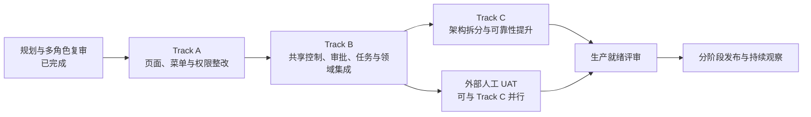

# PR192 房产业务产品化整改执行路线图

## 1. 文档用途

本文档面向产品负责人、业务负责人、项目管理人员、设计与研发团队、测试人员、运营
人员和岗位用户代表，用来共同查看整改工作目前走到哪里、下一步做什么、由谁参与、
什么条件下才算完成。

本文档是执行进度入口，不代替详细需求、技术设计、测试报告或审批记录。需要了解
具体规则时，可查阅同目录下的
[产品需求](./prd.md)、[技术设计](./design.md)、
[实施计划](./implement.md) 和 [评审门禁](./review-gates.md)。

## 2. 更新规则

- 每周至少更新一次；阶段状态变化、出现阻塞或形成重要决定时应当天更新。
- 状态只使用：`未开始`、`进行中`、`已完成`、`阻塞`。
- 没有可复查证据时，不得把阶段标记为“已完成”。
- “技术完成”和“生产就绪”必须分开记录。Codex 可以完成设计、开发、自动测试和
  技术证据，但不能代替真实岗位用户、业务、财务、安全或生产负责人签署。
- 每次更新应填写计划日期、实际日期、证据链接，并在周进展记录中说明变化。
- 发生依赖变化、范围变化或重要取舍时，同时登记到“风险、决策与阻塞记录”。
- 日期统一使用 `YYYY-MM-DD`；尚未确定时填写“待排期”，尚未发生时填写“—”。

## 3. 总体阶段图



通俗地说：先把页面、菜单和权限边界理顺，再补齐共享控制、审批与任务能力，然后
改善内部架构、弱网使用和运行可靠性。真实用户验收在 Track B 技术通过后开始，可与
Track C 并行；只有技术整改和人工验收都通过，才进入生产就绪。

## 4. 当前状态

| 项目 | 当前状态 | 说明 |
|---|---|---|
| 总体规划与多角色复审 | 已完成 | 已形成父任务、11 个规划子任务、阶段依赖、负责人边界和验收门禁 |
| 开发分支与任务登记 | 已完成 | 已建立本次整改分支和 Trellis 任务结构 |
| Track A 合同实现 | 已完成 | shared、民宿/住房 API、数据库权限迁移、17 个 canonical 页面、7 个详情页和 Party 目标均已交付 |
| 业务页面整改 | 已完成 | 民宿 8 个、住房 9 个工作台及对应详情页已拆分并接入权限菜单 |
| 自动化验收执行 | 已完成 | API 91/91、Web 类型检查/静态检查/154 页面构建、数据库证据和独立多轮 Gate 均通过，`open_P0_P1=[]` |
| Track B B-0 合同与数据库扩展 | 已重新关闭 | 终局 3 fresh PG16 独立门禁通过；current B-contract-v2 `e27d5234…7944`、49-row endpoint authority、Identity 行为与 000185–000190 已签署，`B-schema-expand SHA=53e568…6874`、`open_P0_P1=[]`、cleanup PASS |
| Track B B-1 审批运行时 | 已完成 | 三方 B-AR4 与 composition 独立门禁通过；冻结 50 文件 runtime，`open_P0_P1=[]`；结果已被 Track B 终门消费 |
| Track B B-2a 任务运行时 | 已完成（PASS / CLOSED） | C1.5、C2、000195、C3、C4、runtime/callsite、AppModule 与 13-action legacy compatibility 均已签署；纠正版 combined signoff `e61f39d9…c633` 经双独立复审 `P0/P1/P2=0` |
| Track B B-2b 扩展测试数据 | 已完成（PASS / CLOSED） | 唯一正式 run `c2v11_formal_20260802l` 通过双 fresh PostgreSQL、可重复 fixture、11 个负向场景、四阶段冻结与 exact cleanup；架构和 QA 独立复审 GO，`P0/P1/P2=0` |
| Track B 技术交付与 Chrome UAT | 已完成（PASS / ARCHIVED） | 000197、000191/000192、领域集成、迁移恢复演练、共享控制面及完整 Chrome UAT 均已闭合；全矩阵 PASS、产品 P0/P1=0、无跳过，子任务于 2026-08-04 归档 |
| Track C 架构与可靠性 | 已完成（TECHNICAL PASS / ARCHIVED） | final SHA `15b6e8f6...52c0c` 已闭合 canonical port、rollback flags 与 handoff；rollback 19/19、fresh performance 30/30、独立 evidence/cleanup review 与 residual=0 全部通过；2026-08-10 Windows Chrome Profile 1 增量复测 15/15 PASS，历史 BLOCKED 证据保留 |
| 外部人工 UAT 与签署 | 阻塞（`awaiting_human_gate`） | Track B 的机器 Chrome UAT 已完成，但真实岗位、业务、财务、安全/审计及发布负责人尚未验收或签署，Codex 不代签 |
| 生产就绪 | 阻塞（`awaiting_human_gate`） | Track C 技术终门已通过，`codex_execution_status=codex_complete`；仍须等待真人 UAT 和外部签署，当前不得声明 `production_ready` |

当前结论：**Track A 与 Track B 的技术交付均已完成。Track B 最终 Chrome UAT 覆盖
民宿、住房、共享控制面、权限正负向、桌面与 768/390/360/320、键盘/读屏、
200%/400% zoom/reflow、reduced-motion、forced-colors、通知已读、DLQ replay 与审批重试，
全矩阵 PASS、产品 P0/P1=0、无跳过；其 Trellis 子任务已经归档，不得重复执行或重复
归档。Track C 已完成 C1/C2 实现、复杂度/合同/全量 API、统一隔离 PostgreSQL 与
clean-provision 门禁，产品 `open_P0_P1=[]`。E/F 两次 partial 性能轮均不具备 PASS 资格且
已 residual=0 清理；final SHA `15b6e8f6...52c0c` 随后完成 rollback 19/19 与全新未拼接
performance 30/30，formal evidence、独立 evidence/cleanup review 与 residual=0 均通过，
Track C 已 technical PASS 并归档。2026-08-10 已在 Windows Google Chrome Profile 1
完成本地隔离环境增量复测，Chrome 15 项 15 PASS / 0 FAIL，UAT-002 已解决，
`C-P1-CHROME-HOST-ENVIRONMENT` 已关闭；旧 BLOCKED/FAIL 证据继续保留且未被覆盖。
当前唯一剩余环境阻塞为 `ENV-001 / ROLE-NEG-01`。外部真人岗位 UAT 与
业务/财务/安全/发布签署仍为 `awaiting_human_gate`。因此父任务继续
`in_progress`，但 `codex_execution_status=codex_complete`；当前不声明
`production_ready`。**

## 5. Track A：页面、菜单与权限整改

Track A 的目标是先把民宿与住房出租拆成清晰、可授权、可单独进入的工作页面，同时
保持现有业务能力可用。它不等待 Track B 的身份、审批和任务运行时。

### 5.1 详细执行顺序

| 阶段 | 状态 | 负责人 / 参与角色 | 前置条件 | 完成标准 | 证据链接 | 计划日期 | 实际日期 |
|---|---|---|---|---|---|---|---|
| A-0 启动确认 | 已完成 | 项目负责人；产品、架构、研发、测试代表 | 多角色复审结论已通过 | 分支、父任务、11 个子任务、唯一负责人边界和停工条件均已登记；这只代表规划启动完成 | [父任务资料](./) | 2026-07-30 | 2026-07-30 |
| A-1 合同与权限基础 | 已完成 | 共享合同、server safety、民宿/住房 API、环境文档、API menu projection、数据库变更负责人；产品与安全参与 | A-0 完成 | shared、RBAC、17/7 routes、Party target 与 DB evidence 全部闭合，open_P0_P1=[] | [合同与权限任务](../07-30-pr192-a-contract-rbac-foundation/) | 2026-07-30 | 2026-07-31 |
| A-2 共享界面基础 | 已完成 | 共享房产 Web 负责人；domain route owner；QA | A-1 的访问与响应合同已冻结 | 双域消费同一 foundation，机器 Gate 通过；真实浏览器验收转入外部 UAT | [共享界面 handoff](../07-30-pr192-a-shared-web-foundation/) | 2026-07-30 | 2026-07-31 |
| A-2.5 Workbench API/response contract closure | 已完成 | shared-contract、homestay-api、housing-api、schema-migration、asset-party owners；独立 checker | A-base handoff | 全 response/GET/field/file contracts、7 detail routes、9 high-risk、Party target 闭合；open_P0_P1=[] | `3766509`/`44d6769`/`8a0bd17`/`5a557e5`/`d33fad9` | 2026-07-31 | 2026-07-31 |
| A-3 民宿与住房工作台并行整改 | 已完成 | 民宿 Web 负责人、住房 Web 负责人；产品、UI、交互、测试与岗位代表参与 | A-2.5 PASS | 双域工作台和机器 Gate 已交付；真实浏览器验收转入外部 UAT | [民宿](../07-30-pr192-a-homestay-workbenches/)；[住房](../07-30-pr192-a-housing-workbenches/) | 2026-07-31 | 2026-07-31 |
| A-4 Web 菜单、落地页与深链防护 | 已完成 | 菜单权限负责人；住房 route owner 持有 tenant alias；民宿 route owner 参与 | A-3 两份 canonical route SHA | Web menu、legacy landing、Party alias 与 unknown deep-link fail-closed 已进入 integration Gate | `d33fad9`、`bc2ed7f`、`992a6a4` | 2026-07-31 | 2026-07-31 |
| A-5 自动验收与独立复审 | 已完成 | 自动化测试负责人；独立的产品、权限、UX、测试审查者 | A-base 与 routes 已完成 | API 91/91、Web default tsc/lint/build154、DB evidence、open_P0_P1=[]；真实浏览器证据转入外部 UAT | [Track A 自动验收证据](../07-30-pr192-a-automated-gates/) | 2026-07-30 | 2026-07-31 |

### 5.2 Track A 放行原则

- A-1 与 A-2.5 已完成；A-base-core 已 provisioned。
- A-1 内部顺序固定为：A-contract candidate → A-server-safety/field-projection Gate
  → 最终 A-contract SHA → schema migration/exact tests → API-only `/users/me`
  projection。Web menu 不属于此时的可见交付。
- A-2 已完成并由两个领域共同消费；真实浏览器证据按用户决定转入外部 UAT，
  不回填为自动化已通过。
- A-base handoff、A-2.5 合同和领域 route SHA 均已冻结。
- A-3 先交付实际页面地址，A-4 再建立菜单、落地页和跳转，避免菜单指向不存在或
  尚未验收的页面。
- A-4 只能消费 homestay/housing route SHA；domain Web owners 保持各自 app
  routes/guards ownership，menu owner 不创建 route。
- A-5 通过只代表 Track A 技术通过，不代表高风险审批动作可在生产启用。

## 6. Track B：共享控制、审批、任务与领域集成

Track B 在 Track A 技术通过后进行，补齐共享房产控制面、身份资料、审批执行、任务
分配以及民宿和住房的领域集成。各部分分开交付，避免把多个运行时混成一个不可审查
的大改动。

| 阶段 | 状态 | 负责人 / 参与角色 | 前置条件 | 完成标准 | 证据链接 | 计划日期 | 实际日期 |
|---|---|---|---|---|---|---|---|
| B-0 合同与数据库扩展 | 已重新关闭（PASS / CLOSED） | 共享合同负责人、数据库变更负责人、架构审查者 | Track A 技术通过 | current B-contract-v2 `e27d5234…7944` 与 `B-schema-expand SHA=53e568…6874` 已通过终局独立门禁；`open_P0_P1=[]`、cleanup PASS | [B-0 终局 Gate](research/b0-schema-final-gate.md) | 2026-07-31 | 2026-07-31 |
| B-0.5 共享房产与模块基础 | 技术通过 / Core Gate 已关闭 | 共享房产 API 负责人、模块依赖负责人；安全与产品参与 | B-0 终局 PASS | Files protected evidence、Identity/Party、control/module 与真实 S0 HTTP+PG16 已独立复验；current `B-property-foundation-runtime-v2 SHA=984fcc8d…63b4`、`B-identity-ui-input SHA=5aa7e79…73a5`、`open_P0_P1=[]` | [身份与控制面任务](../07-30-pr192-b-identity-control-plane/) | 2026-07-31 | 2026-07-31 |
| B-1 审批运行时核心 | 已完成（PASS / CLOSED） | 审批运行时负责人；财务、安全、架构和故障测试参与 | B-0 完成；共享房产接口稳定 | 50 文件 runtime 已冻结；三方 B-AR4 与 composition 独立门禁 PASS；`open_P0_P1=[]`；全量 `pnpm test` 因环境缺 `JWT_SECRET` 未登记为 PASS | [B-1 最终门禁与交接](../07-30-pr192-b-approval-runtime-tasks/research/b1-approval-runtime-final-gate.md) | 2026-07-31 | 2026-07-31 |
| B-2a 任务运行时核心 | 已完成（PASS / CLOSED） | 房产任务负责人；审批、领域和并发测试参与 | B-1 审批运行时已交付 | C1.5/C2/000195/C3/C4、legacy `117/117` compatibility、runtime/callsite 与 AppModule 均签署；superseding combined signoff 双复审 `P0/P1/P2=0`，仅释放 B-2b | [B-2a 纠正版最终签署](../07-30-pr192-b-approval-runtime-tasks/research/b2a-combined-final-signoff-superseding-20260801c.md) | 2026-08-01 | 2026-08-01 |
| B-2b B 扩展测试数据 | 已完成（PASS / CLOSED） | module-dependency-owner、自动化测试负责人、迁移核对负责人 | 三个 runtime 已交付；独立 `B-module-core SHA=988eb7e5…93df` 已 handoff | 双 fresh PostgreSQL 下首次写入、精确 no-op、零残留回滚、同 snapshot 重建、A 基础数据不变及 exact cleanup 全部通过；`P0/P1/P2=0` | [B-extension 最终签署](../07-30-pr192-b-domain-integrations/research/b-extension-core-v1-final-signoff.md) | 2026-08-01 | 2026-08-02 |
| B-2c 民宿与住房领域接入 | 已完成（PASS / CLOSED） | approval/task runtime owners、schema-migration-owner、property-foundation-api-owner、民宿/住房 API owners、最终装配负责人 | B-2b 已完成 | 000197 与 000191/000192 change-control、领域 adapter、审批/任务 runtime、一次性业务结果及技术 Gate 均完成，历史失败仅保留审计 | [领域集成技术 Gate](../archive/2026-08/07-30-pr192-b-domain-integrations/research/b2c-domain-integration-technical-gate-handoff-v2-20260803.md) | 2026-08-02 | 2026-08-03 |
| B-3 领域 Web 集成 | 已完成（PASS） | 共享房产、民宿、住房 Web 负责人；UI、交互、测试参与 | B-2c 完成 | identity、notification、event-delivery incident、approval incident 及双域页面完成；最终 Chrome 覆盖 320/360/390/768/desktop、keyboard、screen reader、200%/400% zoom/reflow、reduced-motion、forced-colors | [Chrome UAT handoff](../archive/2026-08/07-30-pr192-b-domain-integrations/research/d5-browser-uat-20260804-handoff.md) | 2026-08-04 | 2026-08-04 |
| B-4 迁移、核对与恢复演练 | 已完成（PASS） | 迁移核对、自动化测试、兼容性测试负责人 | B-3 完成并形成领域交付 | PostgreSQL 身份基础、运行控制、回滚/重新启用及最终质量门均有可复查证据，技术产品 P0/P1=0 | [归档任务元数据](../archive/2026-08/07-30-pr192-b-domain-integrations/task.json) | 2026-08-04 | 2026-08-04 |
| B-5 Track B 技术验收 | 已完成（PASS / ARCHIVED） | 独立安全、财务、架构审查者 | B-0 至 B-4 完成 | 代码、数据库、自动化与真实 Chrome 全矩阵通过；产品 P0/P1=0、无跳过；Trellis 子任务已归档 | [归档任务](../archive/2026-08/07-30-pr192-b-domain-integrations/) | 2026-08-04 | 2026-08-04 |

Track B 技术通过后，高风险生产开关仍保持关闭，直到外部人工 UAT 和生产就绪评审
完成。

## 7. Track C：架构与可靠性

Track C 只依赖 Track B 的技术交付，不等待人工 UAT。它以不改变已有业务行为为前提，
改善代码边界、页面稳定性、手机与弱网体验、上传队列、性能和可回退性。

| 阶段 | 状态 | 负责人 / 参与角色 | 前置条件 | 完成标准 | 证据链接 | 计划日期 | 实际日期 |
|---|---|---|---|---|---|---|---|
| C-0 接管确认与现状基线 | 已完成 | 架构负责人、民宿/住房原负责人、共享 Web 负责人、测试 | Track B 技术交付；相关路径完成明确交接 | ownership、合同与离线路径输入已冻结 | [Track C 归档任务](../archive/2026-08/07-30-pr192-c-architecture-reliability/) | 2026-08-04 | 2026-08-04 |
| C-1 后端职责拆分 | 已完成（技术 PASS） | 民宿、住房后端负责人；架构和回归测试参与 | C-0 完成 | HomestayService 498 行、HousingService 488 行；职责拆分为原子提交，合同 SHA 不变，独立复审产品 `open_P0_P1=[]` | [Track C 归档状态](../archive/2026-08/07-30-pr192-c-architecture-reliability/task.json) | 2026-08-04 | 2026-08-04 |
| C-2 前端、弱网与上传可靠性 | 已完成（技术 PASS） | 民宿、住房前端负责人、可靠性负责人；现场用户代表参与 | C-0 完成；共享离线路径完成专门交接 | C1/C2 技术实现已完成；全量 API 966 PASS / 13 条件 skip / 0 fail，统一隔离 PostgreSQL 5/5 PASS / 0 skip | [Track C 归档状态](../archive/2026-08/07-30-pr192-c-architecture-reliability/task.json) | 2026-08-04 | 2026-08-04 |
| C-3 性能、复杂度与证据 | 已完成（PASS） | 性能测试、质量和发布文档负责人 | C-1、C-2 完成 | final SHA rollback 19/19；fresh 30-cell 30/30，p95 max 200.374ms、error 0、CV max 0.04935；formal evidence SHA `1a451ecf...4ff2`；residual=0 | [Track C 最终交接](../archive/2026-08/07-30-pr192-c-architecture-reliability/research/final-technical-handoff-20260806.md) | 2026-08-04 | 2026-08-06 |
| C-4 独立技术复审 | 已完成（TECHNICAL PASS） | 独立架构、QA、发布审查者 | C-1 至 C-3 完成 | 独立 performance evidence review APPROVE（P0/P1=0）且 cleanup review APPROVE（P0/P1/P2=0）；原 Chrome 环境 P1 已于 2026-08-10 通过 Windows Chrome Profile 1 复测关闭，历史 BLOCKED 证据保留 | [PR223 Windows UAT 任务](../08-10-pr223-windows-real-browser-uat/) | 2026-08-04 | 2026-08-10 |

## 8. 外部人工 UAT

真实岗位验收不由 Codex 或开发人员代签。它在 Track B 技术通过后启动，可与 Track C
并行进行。

| 阶段 | 状态 | 负责人 / 参与角色 | 前置条件 | 完成标准 | 证据链接 | 计划日期 | 实际日期 |
|---|---|---|---|---|---|---|---|
| U-1 UAT 准备 | 未开始 | Codex 协调者、测试负责人、业务负责人 | Track B 技术通过；隔离环境可用 | 测试账号、园区、数据、任务卡、录屏和问题模板准备完成；不会影响生产数据 | [待补：UAT 准备清单](../07-30-pr192-human-uat-production-readiness/) | 待排期 | — |
| U-2 真实岗位走查 | 未开始 | 民宿运营、住房运营、资产管理员、财务、审批人、园区管理员、审计/安全代表 | U-1 完成 | 各岗位完成自己的常见任务、异常任务和权限负向检查；问题有严重级别和复现证据 | 待补：岗位 UAT 记录 | 待排期 | — |
| U-3 问题修复与复验 | 未开始 | 原功能负责人、独立复验者、岗位代表 | U-2 发现问题 | P0/P1 全部关闭并由非修复者复验；必要时相关自动测试同步补齐 | 待补：UAT 闭环报告 | 待排期 | — |
| U-4 人工签署 | 未开始 | 业务、财务、安全/审计、生产发布负责人 | U-2/U-3 完成 | 页面名称、权限包、审批阈值、紧急处置和生产开关获得明确签署 | 待补：签署记录 | 待排期 | — |

## 9. 生产就绪与发布

| 阶段 | 状态 | 负责人 / 参与角色 | 前置条件 | 完成标准 | 证据链接 | 计划日期 | 实际日期 |
|---|---|---|---|---|---|---|---|
| R-1 生产就绪总评审 | 未开始 | 发布负责人；产品、业务、财务、安全、架构、测试参与 | Track A/B/C 技术通过；人工 UAT 签署完成 | 所有必需证据齐全；没有未接受的 P0/P1；迁移、备份、回退、监控和值班方案获批 | 待补：生产就绪评审记录 | 待排期 | — |
| R-2 分阶段启用 | 未开始 | 发布与运维负责人；各功能负责人值守 | R-1 通过 | 先小范围、低风险启用；高风险能力按批准范围开启；每一步均有健康检查和回退点 | 待补：发布与开关记录 | 待排期 | — |
| R-3 发布后观察 | 未开始 | 运维、运营、产品、研发、测试 | R-2 完成 | 关键错误、财务一致性、审批积压、任务积压、性能和用户反馈达到批准标准；完成部署后清理 | 待补：观察期与清理报告 | 待排期 | — |

## 10. 周进展记录

每周复制以下模板追加一条，不覆盖历史记录。

### 周进展模板

```text
周期：YYYY-MM-DD 至 YYYY-MM-DD
更新人：

本周总体状态：未开始 / 进行中 / 已完成 / 阻塞

本周完成：
1.
2.

已形成证据：
- 任务、PR、测试报告、截图或验收记录：

下周计划：
1.
2.

需要业务或管理层确认：
-

新增或变化的风险、决定、阻塞编号：
-
```

### 周进展记录

| 周期 | 总体状态 | 本周完成摘要 | 下周重点 | 证据链接 | 更新人 |
|---|---|---|---|---|---|
| 2026-07-30 至待更新 | 未开始 | 完成整改规划、多角色复审、任务拆分和执行路线图 | 启动 Track A 合同与权限基础 | [父任务资料](./) | emvia / Codex |
| 2026-07-30 至待更新 | 进行中 | 启动 A-1 代码/契约基线研究；当前仅只读盘点 shared、route、RBAC、迁移和测试模式 | 汇合 IA/route 与 RBAC 研究，冻结 A-contract 实施输入 | [A-1 任务](../07-30-pr192-a-contract-rbac-foundation/) | emvia / Codex |
| 2026-07-30 至待更新 | 进行中 | 已形成 shared contract candidate 并完成基础构建、类型、lint 和合同测试；独立复审发现 server fail-closed 缺口及 housing tenant、homestay credential 两组字段投影漂移，A-1 未完成 | 由 infrastructure/homestay/housing/env-doc owners 闭合 A-server-safety Gate；通过前不启动 A-C2 menu/migration | [A-1 stop-ship](../07-30-pr192-a-contract-rbac-foundation/) | emvia / Codex |
| 2026-07-30 至待更新 | 进行中 | A0-S PASS，baseline 已冻结；A-C2 只读复审发现 17 routes 未落地，提前完成 Web menu 会进入 catch-all placeholder；权威顺序已修正 | 先 schema migration/exact tests，再 API `/users/me` projection；随后 shared/A-base、domain route SHA、Web menu、route evidence | [A-1 Gate 记录](../07-30-pr192-a-contract-rbac-foundation/) | emvia / Codex |
| 2026-07-30 至待更新 | 进行中 | A-C2 独立 DB runtime fixture 与 API projection slice PASS：000183 双跑、65 exact、scope/module/relation 负向、timestamp 稳定、cleanup `0|0|0|0`；临时容器/卷已删除 | 启动 shared Web；A-base 先完成 reusable ephemeral bootstrap | [A-C2 Gate 记录](review-gates.md) | emvia / Codex |
| 2026-07-30 至待更新 | 进行中 | A-base S0 P1 已关闭：bootstrap 独立 review PASS，4项P1修复，owner 7/0/1、Linux SIGTERM 1/1、same-run-id 双链、checker runtime 与 residual=0 | 当时下一步为 A0 implementation；该状态已由后续 A-base Final Gate 更新 | [A-base S0 Gate](review-gates.md) | emvia / Codex |
| 2026-07-30 至待更新 | 进行中 | 多领域只读复审确认 workbench response/detail/finance/file contracts 与 Party target 尚未闭合；新增串行 A-2.5 独立 Gate，domain Web stop-ship | A-base handoff 后先闭合 A-2.5 并取得 `open_P0_P1=[]`，再启动 domain Web | [A-2.5 复审记录](review-gates.md) | emvia / Codex |
| 2026-07-30 至待更新 | 进行中 | A-base source `32ccc028…` final run `abase20260730final32ccc01` 独立 PASS；21/0/6、真实双 run、journals 两次各 10,010/2,002 均清理、residual=0；fixture=`3cb78fe3…` 已冻结 | 立即执行 A-2.5；domain Web 继续 blocked，route evidence 继续 pending | [A-base Final Gate](review-gates.md) | emvia / Codex |
| 2026-07-31 至待更新 | 进行中 | B-1 审批运行时通过三方 B-AR4 和独立 composition Gate；冻结 50 文件 runtime，联合 PostgreSQL 15/15，`open_P0_P1=[]` | 启动 B-2a 房产任务运行时独立实施与门禁；Track B 继续进行 | [B-1 最终门禁](../07-30-pr192-b-approval-runtime-tasks/research/b1-approval-runtime-final-gate.md) | emvia / Codex |
| 2026-08-01 至待更新 | 进行中 | B-2a targeted 已 PASS；full-b 已完成 2M、40 warmup、160 measured、watchdog、8 文件 hash 链与 cleanup，架构/数据库和产品/RBAC 接受；测试/安全发现 attempt timeout 精确字段缺失及 forced-lock 未按 remaining budget 取值，结论 RETURNED（P1=2） | 形成 v12c 纠偏候选，重跑 full，并再次进行三方离线复算；C2 签署前不释放 C3/C4 | [B-2a C2 证据目录](../07-30-pr192-b-approval-runtime-tasks/research/) | emvia / Codex |
| 2026-08-01 至待更新 | 进行中 | B-2a C2 v12d 唯一 runId 完整门禁 PASS；主件与 5 sidecars、watchdog、manifest 闭合，40 warmup、160 measured、2M 性能和精确 cleanup 通过；三方最终复审 `P0/P1=0`，C2 已签署 | 按 owner 边界实施 C3 窄 receipt port，并对 B-1、foundation、AppModule 执行 v2 re-attestation；独立 Gate 前 C4 保持封锁 | [B-2a C2 最终签署](../07-30-pr192-b-approval-runtime-tasks/research/b2a-c2-final-gate-signoff-v12d.md) | emvia / Codex |
| 2026-08-01 至待更新 | 进行中 | C3 静态预检发现历史 B1 receipt 无 task identity/resultVersion，原“全部迁移到统一 Port”合同不可执行；经产品/RBAC、架构/数据库、测试/安全四轮复审，C3-0 双版本兼容合同以 `P0/P1=0` 接受，冻结 13 条 legacy 与 8 条 port-v2 动作 | 仅实施并独立验证 C1.5 合同/shared/foundation 重签；C1.5 PASS 后才正式 reservation 和创建 000195，C4 继续 blocked | [C3-0 预签](../07-30-pr192-b-approval-runtime-tasks/research/b2a-c3-0-pre-signoff.md) | emvia / Codex |
| 2026-08-01 至待更新 | 进行中 | C1.5 独立总门禁 PASS：新 B-contract、shared、13/8 manifests、foundation v2 与 AppModule 重验全部闭合；三方 `P0/P1=0`，Shared 4/4、API build/typecheck、定向 7/7 与 bilateral 2/2 PASS | 唯一 schema owner 重扫双 history/worktree，正式 reservation 并实施 000195 独立 PostgreSQL Gate；C3/C4 继续串行 blocked | [C1.5 最终门禁](../07-30-pr192-b-approval-runtime-tasks/research/b2a-c1-5-final-gate.md) | emvia / Codex |
| 2026-08-01 至待更新 | 进行中 | 000195 独立 PostgreSQL Gate 正式 run `b2ac30_formal_20260801f` PASS：13/13、39 legacy、11+7 失败回滚、24 controls/audits、rerun exact no-op、hash 链与 cleanup 闭合；数据库、测试安全、产品兼容三方 `P0/P1/P2=0` | 实施 C3 窄 receipt port，并对 B-1、foundation、AppModule 做 v2 重认证；C3 业务 Gate 通过前 C4 保持 blocked | [000195 最终签署](../07-30-pr192-b-approval-runtime-tasks/research/b2a-c3-0-000195-final-gate-signoff.md) | emvia / Codex |
| 2026-08-01 至待更新 | 进行中 | C3 mutation receipt runtime 正式 run `b2ac3_runtime_formal_20260801d` PASS：23/23 PostgreSQL、19 项本地回归、输入冻结、不可变产物及 exact cleanup 闭合；approval/foundation/AppModule v2 sidecar 经纠偏后终审 `P0/P1/P2=0` | 仅释放 `property-task-owner` 开始 C4 runtime；C4 独立总门禁前 B-2b 保持 blocked | [C3 最终签署](../07-30-pr192-b-approval-runtime-tasks/research/b2a-c3-final-gate-signoff.md) | emvia / Codex |
| 2026-08-01 至待更新 | 进行中 | C4 代表性正式 run `b2ac4_runtime_formal_20260801h` PASS：代表性 PostgreSQL 并发场景、本地门禁、输入冻结、artifact/manifest 与专属容器/匿名卷 exact cleanup 闭合，`open_P0_P1=[]`；证据明确保留 `cross_operation_matrix_complete=false` | 补齐 command/source-terminal/rebuild 的完整双向跨操作矩阵，以新唯一 runId 运行独立 PostgreSQL Gate；通过后再执行 AppModule 单文件装配与 C4 终签，B-2b 继续 blocked | [C4 代表性 Gate artifact](../07-30-pr192-b-approval-runtime-tasks/research/c4-runtime-formal-candidate-20260801h.json) | emvia / Codex |
| 2026-08-01 | 已完成 | B-2a 纠正版 combined final signoff `e61f39d9…c633` 双独立 GO：C4 `93/93`、跨操作 `73/73`、AppModule local `12/12` + PG `4/4`，C1.5 legacy compatibility local `240/240` + PG `23/23` + `117/117` exact，全部 exact cleanup | 仅启动 B-2b 可重复扩展测试数据与独立门禁；B-2c、B-3、B-4、B-5 继续串行 blocked | [B-2a 纠正版最终签署](../07-30-pr192-b-approval-runtime-tasks/research/b2a-combined-final-signoff-superseding-20260801c.md) | emvia / Codex |
| 2026-08-01 | 进行中 | B-2b 写前预检发现缺失独立 `B-module-core SHA`，未创建 fixture 或容器；纠偏计划经两轮交叉复审后 GO，P0/P1/P2 均为零 | 先执行 module-core 真实 PostgreSQL/Nest 行为门禁并签署可复算 handoff；通过后再启动 B-extension fixture/validation 双门禁 | [B-2b 前置门禁纠偏计划](../07-30-pr192-b-domain-integrations/research/b2b-module-core-precondition-correction-plan.md) | emvia / Codex |
| 2026-08-01 | 已完成 | module-core 正式 run e 通过 13/13 static、4/4 targeted、5/5 PostgreSQL/Nest、typecheck/build/lint、五份上游 sidecar 和 exact cleanup；14 文件 grammar 双独立复算 GO，`B-module-core SHA=988eb7e5…93df` | 启动 B-extension fixture/validation；取得两份独立 SHA 前 B-2c 继续 blocked | [B-module-core 最终 handoff](../07-30-pr192-b-domain-integrations/research/b-module-core-v1-handoff-signoff.md) | emvia / Codex |
| 2026-08-02 | 已完成 | B-extension 唯一正式 run `c2v11_formal_20260802l` 通过两套 fresh PostgreSQL、10 个迁移及即时重跑、23 项闭合校验、11 个负向场景、51 文件四阶段冻结和 exact cleanup；架构与 QA 独立 GO，`P0/P1/P2=0` | B-2b 正式关闭；启动 B-2c 写前预检并串行核验 000191、000192 与 property-foundation adapter，B-3 及后续继续 blocked | [B-extension 最终签署](../07-30-pr192-b-domain-integrations/research/b-extension-core-v1-final-signoff.md) | emvia / Codex |
| 2026-08-02 | 进行中 | B-2c 写前预检 RETURNED：双 SHA/authority locator 已补齐，但审批 command/projection ports、task registry composition、service-level stop-ship、九个入口权限及正式 migration reservation 尚未闭合 | 先由冻结 runtime owners 完成四项 P0 纠偏与独立 Gate；通过后才执行 000191/000192 reservation，当前不写领域 adapter | [B-2c 写前预检](../07-30-pr192-b-domain-integrations/research/b2c-write-free-preflight-20260802.md) | emvia / Codex |
| 2026-08-02 | 已完成 | B-2c service-level stop-ship 与九个高风险入口权限 lane 经返修后独立 GO：高风险权限精确 403→稳定 409、混合路由低风险兼容、53 项定向测试；12-file runtime SHA `188b38dd…f0a`、`P0/P1/P2=0` | 继续 approval ports 与 task composition 两项 runtime seam；二者签署前不执行 migration reservation | [Stop-ship/permission handoff](../07-30-pr192-b-domain-integrations/research/b2c-stopship-permission-runtime-v1-handoff.md) | emvia / Codex |
| 2026-08-02 | 已完成 | B-2c task composition 重签后通过架构、QA 双 GO：shared grammar `af7ddf14…2f0d`、runtime `3256cdf1…5fe7`、final signoff `debaab4c…faaa`，`productionEnablement=false` | 关闭 `B2C-P0-TASK-COMPOSITION`；不释放 domain、AppModule 或 migration | [Task composition 最终签署](../07-30-pr192-b-domain-integrations/research/b2c-property-task-composition-final-signoff.md) | emvia / Codex |
| 2026-08-02 | 进行中 | B-2c approval port 合同重签为 `5ceaf6db…a4a55`；shared v3 `fa76110b…2eb6` 与 runtime v4 `4c8ea26d…d5ae` 的代码、单元和 PostgreSQL suite 设计均双独立 GO，`P0/P1/P2=0` | 保持 `SCHEMA-BLOCKED / PG NOT RUN`；先完成 000197 预约与独立迁移 Gate，再运行 approval PG Gate 并发布 current authority | [Approval runtime v4 handoff](../07-30-pr192-b-domain-integrations/research/b2c-approval-port-runtime-implementation-v4-handoff.md) | emvia / Codex |
| 2026-08-02 | 已失败 / 已封存 | 000197 preliminary run `b2c197_prelim_20260802a` 在 A/B 完成迁移、索引/谓词、状态矩阵、故障注入与 exact history 后，于 target A approval-port PG child 非零退出；stdout/TAP 未持久化，root cause 保持 UNKNOWN；FAILED artifact `452507c7…244b`，A/B 无 residue 并永久退出 absent retry | 修复所有子进程 throw 前证据持久化及 run-scoped、try/finally、幂等清理 PG fixture；全新 exact chain 双审后申请新 runId、新容器/卷和新授权；A/B 只用于 later-apply | [FAILED disposition](../07-30-pr192-b-domain-integrations/research/b2c-000197-preliminary-failed-disposition-b2c197_prelim_20260802a.json) | emvia / Codex |
| 2026-08-02 | 进行中 | 用户已授权后，G/H attempt02 在外层提权下唯一执行成功：两个专属库到 000195、全部证据 `0444`、无清理/无重试。独立 regression v4 已创建无端口 PG16+匿名卷并唯一执行，但 `pg_dump 16.14` 基线恢复的旧索引目录哈希为 `97c69e… / 8d3c44…`，不同于 000197 权威 `89d630… / d47740…`；预检 fail-closed，故障注入与 000197 均未运行，旧 run 不可复用 | 新候选必须以冻结迁移字节直接构建基线，增加恢复后目录证明，以新 runId/容器/卷重新取得 DB、QA、resource Gate；之后才可重封 formal candidate、取得新 3-GO、执行 drain。Track B/C 均未完成 | [v4 失败独立复审](../07-30-pr192-b-domain-integrations/research/b2c-000197-v11-v6-pg-regression-v4-preflight-failure-independent-database-review-20260802.grammar) | emvia / Codex |
| 2026-08-04 | 已完成 | Track B 后续前向迁移、领域集成、恢复控制、最终质量门及真实 Chrome UAT 已闭合；全矩阵 PASS、产品 P0/P1=0、无跳过，子任务已归档 | 不重复执行或归档 Track B；按父任务顺序推进 Track C | [Track B 归档任务](../archive/2026-08/07-30-pr192-b-domain-integrations/) | emvia / Codex |
| 2026-08-04 | 进行中 | Track C 早期代码/PG Gate 通过；E 在 23/30 后外部中断，F 在 1/30 后因 hard AC 缺口主动停止，两轮均保留 partial 且 residual=0；产品 P0/P1仍为0，Chrome 15/15环境 BLOCKED | 修复 canonical occupancy port 与双 rollback flags，完成 rollback/output handoff；冻结 final SHA 后重新完整跑 30-cell，不拼接 E/F | [Track C 归档任务](../archive/2026-08/07-30-pr192-c-architecture-reliability/) | emvia / Codex |
| 2026-08-06 | 已完成（Codex technical） | Track C final SHA 完成 rollback 19/19、fresh performance 30/30、formal gate、独立 evidence/cleanup review 和 residual=0；Track C 已归档，产品 P0/P1=0；Chrome 15/15 环境 BLOCKED 保留 | 父任务 Codex 技术泳道结束；转入外部真人 UAT、业务/财务/安全/发布签署和 production readiness，不代签 | [Track C 最终交接](../archive/2026-08/07-30-pr192-c-architecture-reliability/research/final-technical-handoff-20260806.md) | emvia / Codex |
| 2026-08-10 | 阻塞（外部环境） | Windows Chrome Profile 1 已完成 PR223 本地隔离环境复测：Chrome 15/15 PASS、UAT-002 与 C-P1-CHROME-HOST-ENVIRONMENT 已关闭、总矩阵 47 PASS / 0 FAIL / 1 BLOCKED、residual=0 | 仅复测 `ENV-001 / ROLE-NEG-01`；继续等待真人岗位、业务、财务、安全及发布签署，不声明 production_ready | [PR223 Windows UAT 任务](../08-10-pr223-windows-real-browser-uat/) | emvia / Codex |

## 11. 风险、决策与阻塞记录

### 11.1 风险记录模板

| 风险编号 | 日期 | 风险描述 | 影响阶段 | 可能性 / 影响 | 应对措施 | 负责人 | 目标日期 | 当前状态 | 证据链接 |
|---|---|---|---|---|---|---|---|---|---|
| RISK-待编号 | YYYY-MM-DD | 待填写 | Track ? | 低/中/高 | 待填写 | 待填写 | YYYY-MM-DD | 开放/观察/关闭 | 待补 |
| RISK-A-001 | 2026-07-30 | manifest 标记 blocked 但缺 server-side high-risk 409 boundary，且 canonical metadata 缺失/不匹配曾可能 fail open | A-1 / A-C2 | 中 / P0 | 已实现三态、8-action exact matrix、canonical metadata default-deny 并通过独立复审 | property-workbench-safety、homestay API、housing API owner | 2026-07-30 | 关闭 | [A-1 Gate 记录](../07-30-pr192-a-contract-rbac-foundation/) |
| RISK-A-002 | 2026-07-30 | housing tenant list/create 可能返回完整 `mobile`/`email` | A-1 | 高 / P1 | server response projection + list/create snapshot 负向断言已通过 | housing API owner | 2026-07-30 | 关闭 | [A-1 Gate 记录](../07-30-pr192-a-contract-rbac-foundation/) |
| RISK-A-003 | 2026-07-30 | homestay booking/credential 响应可能返回完整 `credentialReference` | A-1 | 高 / P1 | detail/issue/return 共用 masked projection + 三入口 snapshot 已通过 | homestay API owner | 2026-07-30 | 关闭 | [A-1 Gate 记录](../07-30-pr192-a-contract-rbac-foundation/) |
| RISK-A-004 | 2026-07-30 | A-C2 临时 DB bootstrap 未复用，A0 docker harness 不能独立复验 | A-base | 高 / P1 | 4项P1修复并独立review PASS；handoff=`b734460703f061feecd5a4fac60a6ee8aad9771cd4ea4a9413d2fa60d27f6268`；关键runtime与residual=0 | a-bootstrap-owner / independent checker | 2026-07-30 | 关闭 | [A-base S0 Gate](review-gates.md) |
| RISK-A-005 | 2026-07-30 | workbench contracts 与 Party target 未闭合的历史风险 | A-2.5 / A-3 | 高 / P1 | A-2.5、Party、双域工作台与独立 Gate 已完成 | A-2.5 owners / independent checker | 2026-07-31 | 关闭 | [最终 Gate](review-gates.md) |
| RISK-B-2A-001 | 2026-08-01 | C2 schema/projection 候选曾存在证据身份不一致、超时回滚阻塞、迁移历史覆盖和测试矩阵不完整风险 | B-2a C2-C4 | 高 / P1 | 已依次完成静态、targeted PostgreSQL、v12d 完整 PostgreSQL、根代理复算与产品/架构/测试三方独立 Gate；C2 `open_P0_P1=[]`，下游风险转由 C3/C4 各自门禁约束 | B-2a owner / independent reviewers | 2026-08-01 | 关闭 | [B-2a C2 最终签署](../07-30-pr192-b-approval-runtime-tasks/research/b2a-c2-final-gate-signoff-v12d.md) |
| RISK-B-2A-002 | 2026-08-01 | 原 C3 统一 receipt 合同无法同时保持历史 B1 hash 字节并提供 task resultVersion，强行实现会伪造身份或破坏 replay | B-2a C3-C4 | 高 / P1 | C3-0 冻结 legacy-v1/port-v2 三 owner lane、item/source-rebuild identity union、13/8 action manifests、000195/000196 串行退出合同；四轮三方复审 `P0/P1=0` | C1.5/Schema/C3 owners / independent reviewers | 2026-08-01 | 关闭（仅释放 C1.5） | [C3-0 方案](../07-30-pr192-b-approval-runtime-tasks/research/b2a-c3-0-receipt-contract-correction-plan.md) |

### 11.2 决策记录模板

| 决策编号 | 日期 | 需要决定的问题 | 可选方案 | 最终决定与原因 | 决策人 / 参与人 | 影响范围 | 复查日期 | 证据链接 |
|---|---|---|---|---|---|---|---|---|
| DEC-待编号 | YYYY-MM-DD | 待填写 | A / B / C | 待填写 | 待填写 | 待填写 | YYYY-MM-DD | 待补 |
| DEC-A-001 | 2026-07-30 | Track A 在尚无 approval runtime 时如何处理高风险 API | 仅隐藏 UI / 全时阻断 / 按工作台 flag 阻断 | 已通过的 A-C1 历史基线为 true 时 8 action 服务端 409；A-2.5 必须把 move-out financial variant 纳入第 9 项，super 不绕过；Track B adapter 后才替换 | 产品、安全、架构、API | Track A/B compatibility 与 rollout | A-2.5 Gate 后 | [A-1 设计](../07-30-pr192-a-contract-rbac-foundation/design.md) |

### 11.3 阻塞记录模板

| 阻塞编号 | 发现日期 | 阻塞事项 | 被阻塞阶段 | 解除条件 | 负责协调人 | 下一检查日期 | 当前状态 | 证据链接 |
|---|---|---|---|---|---|---|---|---|
| BLOCK-待编号 | YYYY-MM-DD | 待填写 | Track ? | 待填写 | 待填写 | YYYY-MM-DD | 开放/已解除 | 待补 |
| BLOCK-B-2A-C2-001 | 2026-08-01 | full-b timeout P1 与 full-c cleanup 竞态曾阻断 C2 | B-2a C3/C4 | v12d 自动完成有界 cleanup 并证明 exact container/volume 全 absent；根代理复算与三方独立签署 `open_P0_P1=[]` | Codex | 2026-08-01 | 已解除（仅释放 C3） | [B-2a C2 最终签署](../07-30-pr192-b-approval-runtime-tasks/research/b2a-c2-final-gate-signoff-v12d.md) |
| BLOCK-B-2C-197-001 | 2026-08-02 | regression v4 曾因旧索引目录摘要漂移 fail-closed | B-2c / 000197 | 以新资源完成后续前向恢复、技术 Gate 和最终 Chrome UAT | Codex | 2026-08-04 | 已解除 | [Track B 归档任务](../archive/2026-08/07-30-pr192-b-domain-integrations/) |
| C-P1-CHROME-HOST-ENVIRONMENT | 2026-08-04 | Track C Chrome 增量曾在插件执行前被 `sandboxCwd is not a local file URI` 宿主错误阻断，15/15 BLOCKED、截图 0 | C-4 / Chrome 增量证据 | 已在 Windows Google Chrome Profile 1 本地隔离环境原样复测，Chrome 15/15 PASS；历史 BLOCKED 证据保留 | Codex / Chrome 宿主环境 | 2026-08-10 | 已解除 | [PR223 Windows UAT 任务](../08-10-pr223-windows-real-browser-uat/) |
| ENV-001 / ROLE-NEG-01 | 2026-08-10 | `no_access` fixture 在登录阶段返回 `Forbidden resource`；虽 fail-closed，但无法进入 authenticated shell 完成菜单与直链负向矩阵 | 外部浏览器 UAT | 修正本地隔离 fixture 的模块/权限装配后，仅复测 ROLE-NEG-01，并保留非泄露式拒绝合同 | Codex / 本地 UAT 环境 | 待环境修复 | 开放（环境阻塞，产品 P1=0） | [PR223 Windows UAT 任务](../08-10-pr223-windows-real-browser-uat/) |

## 12. 下一步

当前权威顺序（2026-08-11）：

1. 不重复执行或重复归档 Track B；其技术 Gate、Chrome UAT 与 Trellis 归档均已完成。
2. Track C canonical port、双 rollback flags、rollback/output handoff、fresh 30-cell 与
   独立复审均已闭合；Track C technical PASS 并归档，不重复执行。
3. Windows Chrome Profile 1 已闭合 Chrome 增量 15/15 与 UAT-002；
   `C-P1-CHROME-HOST-ENVIRONMENT` 已解除，历史 BLOCKED/FAIL 证据不得覆盖或改写。
4. 当前仅剩 `ENV-001 / ROLE-NEG-01`；修正本地 fixture 后只复测该项，不重复 UAT-002
   或 Chrome 15 已通过项，也不得以 API、Playwright、CDP 或内置浏览器替代真实 Chrome。
5. 父任务 `codex_execution_status=codex_complete`，父任务本身继续 `in_progress`，因为
   human/production 两条外部泳道尚未完成。
6. 外部真人岗位 UAT、业务/财务/安全/发布签署继续由
   `07-30-pr192-human-uat-production-readiness` 承载，状态为
   `awaiting_human_gate`；这些签署不能由 Codex 代替，未完成前不得声明生产就绪。

以下为 2026-08-02 及更早的历史执行链，已由上述权威顺序取代，仅保留审计：

1. 保持 `pr192-a-contract-rbac-foundation` 为进行中。
2. 使用 2026-07-30 冻结的 contract/server-safety baseline
   `e709459a034807b3575db604a76bc69bf1c5ff5b`。
3. A-C2 migration+API-only projection slice 已技术通过；保存独立 fixture、
   `000176`–`000182` 基线、000183 双跑、65 exact 与 cleanup 证据。
4. Shared Web foundation integration-ready SHA
   `d2a015f9ba931b2024e6360570697c77b74ea3fb` 已交付但 final UI Gate 等待首个
   canonical route；A-base final run `abase20260730final32ccc01` 已独立 PASS，
   fixture handoff
   `3cb78fe3b7d1d69490bc028f4da460d2fe4d0673f9eb7e13f6a6f47de10eb87c`
   已冻结。Web 保持不可见，A-1 不关闭。
5. A-2.5、两份 domain route、Party alias 与机器 Gate 已完成；真实
   desktop/390/keyboard/zoom route evidence 转入外部 UAT。
6. B-0 的 product/access、identity/control、runtime 与 physical addendum 四输入、
   49-row endpoint authority 和 000185–000190 已通过终局 3 fresh PG16 独立门禁；
   当时 `B-contract=a16f36…f58d8`（现已 superseded），当前 B-contract-v2 为
   `e27d5234…7944`；`B-schema-expand SHA=53e568…6874`、
   `open_P0_P1=[]`、cleanup PASS。B-0 已重新
   CLOSED/PASS。
7. B-0.5 Identity/Party、共享控制面、module dependency 和 protected evidence 已
   通过独立 Core Gate；S0 修正 Gate principal 后以真实 Nest HTTP + PG16 重跑
   exact 409/zero mutation/cleanup PASS。当前 runtime-v2 handoff 为 `984fcc8d…63b4`，
   UI-input handoff 为 `5aa7e79…73a5`，`open_P0_P1=[]`。
8. B-1 approval runtime 已完成：历史 v1 SHA 为 `79691e…2270d`，B-2c current
   approval sidecar 为 `30168511…f589`；三方
   B-AR4 和 composition 独立 Gate PASS，`open_P0_P1=[]`。下一立即动作是启动
   B-2a Property Task Runtime；不得把 B-1 完成扩展为 Track B 或生产就绪完成。
9. B-2a C2 已通过：唯一 full runId `b2ac2_v12_full_20260801d` 完成完整
   PostgreSQL、8 action self measurement、2M 性能、watchdog、精确 cleanup、根代理
   离线复算与产品/架构/测试三方独立 Gate，`open_P0_P1=[]`。下一步只实施 C3
   窄 receipt port 和 B-1/foundation/AppModule v2 re-attestation；C3 独立 Gate 通过前
   C4 保持封锁。
10. C3-0 已通过多视角预签：13 条 legacy-v1 和 8 条 port-v2 action/identity/mode
    manifest 已冻结。当前唯一允许动作是 C1.5 合同、shared validator 与 foundation
    显式版本重签；000195、C3 Port、C4 必须继续按独立门禁串行释放。B4 负责满足
    机器可验证滚动退出条件后执行 000196 drop-default，未通过则 B5 阻断。
11. C1.5 已通过独立总门禁，当前 authority 为 `B-contract=e27d5234…7944`、
    `B-shared-source=d444a85e…633a`、`B-property-foundation-runtime-v2=984fcc8d…63b4`。
    只释放 000195 schema migration owner；历史 13 action bytes continuity 必须在 000195
    old-app/new-schema 与 C3 full B1 regression 两道门禁闭合。
12. 000195 schema Gate 已通过：正式 run `b2ac30_formal_20260801f` 完成 13/13
    动态合同测试、39 条 legacy 连续性、11+7 失败恢复、24 个控制项/审计、exact
    rerun 与精确 cleanup；三方终签 `P0/P1/P2=0`。该结果只释放 C3 receipt port
    业务实现与重认证，不等于 C3、B-2a 或 Track B 完成，且不授权开启任何控制。
13. B-2a 已通过 superseding combined final signoff `e61f39d9…c633` 关闭。C4 正式
    run `b2ac4_runtime_formal_v13_20260801l`、runtime/callsite、AppModule composition
    与 C1.5 legacy compatibility run `b2ac3_legacy_compat_formal_20260801c` 均经独立
    终审 `P0/P1/P2=0`；十三条 legacy action 的 `117/117` 三阶段精确比较闭合。
    B-2b 已由 `c2v11_formal_20260802l` 与最终签署
    `5c5d938e…7e0f` 关闭；当前只释放 B-2c 写前预检和后续串行实施，B-3 及后续、
    外部 UAT 与生产仍 blocked/pending。
14. B-2c 当前保持 `IN_PROGRESS`。G/H attempt02 已在用户授权后成功到 000195，并保留
    只读成功证据。独立 PG regression v4 的首次真实 run 在预检 fail-closed：`pg_dump`
    基线恢复后旧索引目录摘要与 000197 权威合同不一致，尚未运行四项故障注入、000197、
    审批测试或 drain。旧 run、容器、匿名卷和证据均不可复用；不得放宽哈希。下一候选必须
    从冻结迁移字节直建并证明恢复后的旧目录，以新资源和新 DB/QA/resource Gate 重新执行。
    Track B 与 Track C 均不得标记完成。

最终独立 Gate 通过后，B0.5 的第一个代码切片仅实现高风险 fail-closed；B-0 合同
PASS 不等于 B0.5-S0 代码 stop-ship PASS。在 Track B/C 与外部 UAT 完成前，不开启
生产高风险能力，也不把 Track A 技术完成误报为生产就绪。

## 13. 2026-07-31 最终同步

交付 SHA：`3766509`、`44d6769`、`8a0bd17`、`5a557e5`、`d33fad9`、`bc2ed7f`、
`992a6a4`。最终 API full unit 91/91（此前 92 含已撤销临时 spec）、Web default
`tsc`/lint/build 154、DB 与独立多轮 Gate PASS，`open_P0_P1=[]`。

真实 desktop/390 视觉、键盘、zoom/reflow 未执行，按用户决定转入外部 UAT。
因此 Track A 标记为技术完成，但 roadmap 不宣称生产就绪或人工 UAT 已通过。
