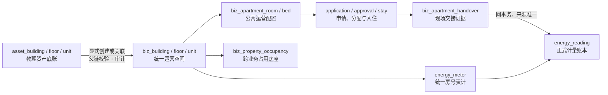

# 公寓、资产与能源一体化架构

## 结论

公寓模块不再创建独立房号。平台保留两个有明确职责的层次：`asset_*` 是物理资产底账，`biz_*` 是所有经营业务共享的运营空间；`biz_apartment_room` 只是把统一运营房号纳入公寓管理的领域配置。能源表计同样挂在统一运营房号上，入住和退房交接生成可追溯的正式能源读数。

## 主数据与生命周期

| 对象 | 权威职责 | 禁止承担 |
| --- | --- | --- |
| `asset_unit` | 权属、资产编码、物理层级和资产属性 | 入住、分配、业务占用 |
| `biz_unit` | 跨公寓、租赁、住房、工单和能源的统一房号 ID | 资产原值和权属历史 |
| `biz_apartment_room` | 公寓类型、性别策略、容量、设施和管理启停 | 重复保存楼栋/楼层/房号主数据 |
| `biz_property_occupancy` | 公寓域保留及跨业务冲突 | 人员到床位的明细 |
| `biz_apartment_stay` | 人员、床位和入住期间 | 物理资产或整房主档 |
| `energy_meter` / `energy_reading` | 表计及不可重复的计量事实 | 交接物品、钥匙和现场照片 |

## 已形成的闭环

1. 资产侧通过显式转换或关联生成运营楼栋、楼层、房号；父层未映射时不能跳级创建。
2. 公寓侧搜索和筛选现有统一房号，以稳定原因码解释不可纳入项；提交时锁定房号并用同一规则重验。
3. 纳入后建立公寓域保留占用；停用释放、恢复重新校验并激活同一来源占用。床位缩容只停用无历史床位。
4. 入住/退房交接按 stay 对应房号读取真实水电表，逐表记录读数。交接、已确认能源读数、表计当前值和 stay 状态在同一事务提交。
5. 无表计的代管/存量房可以完成交接，但系统不会伪造能源数据；运营手册明确要求后续补齐表计。

## 存量上线边界

- 先使用只读基线审计将数据分为确定性匹配、属性冲突和无法匹配三类，再由业务负责人审核。
- 本轮迁移均为前向新增，不删除 `asset_*`、`biz_*` 或公寓历史，也不自动批量改写生产映射。
- 本地基准数据库缺少公寓基础表，因此不能作为生产存量报告；生产执行前需在已完成迁移的备份恢复库和生产只读账号下分别运行审计。
- 后续调房、维修封锁、住宿计费和生产约束收紧是独立增量，不改变本架构的主数据方向。
