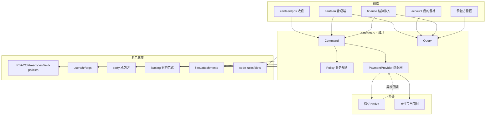
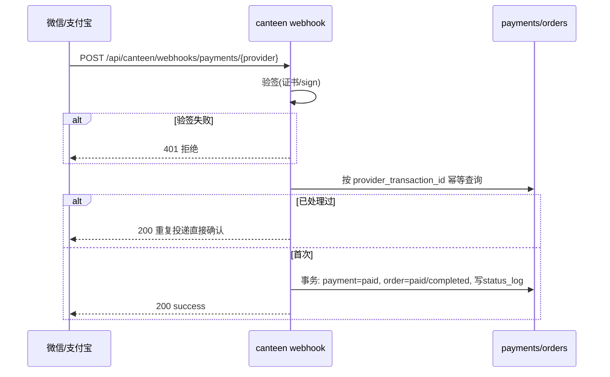

# 园区餐厅管理（食堂承包经营）模块 — 架构与落点

> 所属模块：`canteen`（园区餐厅管理 / 食堂承包经营）
> 当前阶段：规划设计（架构方案，不含生产代码）
> 表/字段/状态以 data-model.md 为准，权限点以 permissions.md 为准，接口以 api.md 为准。

---

## 1. Monorepo 落点

```
apps/api/src/modules/canteen/                 # NestJS 后端模块（新增）
  outlets/  categories/  dishes/
  orders/  order-items/  payments/  qr-codes/
  cashier-sessions/  refunds/
  wallet/  subsidy-grants/  wallet-txns/  meal-records/
  settlements/  settlement-items/
  reports/  dashboard/
  payment-provider/                           # 端口 + 适配器（见 §4）
  tasks/                                      # 定时任务：发放/清零/结算聚合
  common/                                     # 状态机/金额/规则常量

apps/web/app/canteen/                          # 管理端（新增）
apps/web/app/canteen/pos/                      # POS 终端（全屏横屏触摸）
apps/web/app/account/                          # 个人中心内嵌「我的餐补」（扩展既有 account）
finance/                                       # 财务端嵌入结算页（在 finance 下扩展，复用其布局）
```

- 后端：`apps/api/src/modules/canteen/`，按资源目录拆分；通过 Nest Module 注册 `CanteenModule`，在 `app.module` 接入。
- 前端：App Router `apps/web/app/canteen/`；POS 为独立全屏横屏路由；个人餐补入口内嵌在既有 `account`；财务端在 finance 路由下嵌入结算视图。
- 实体继承 `apps/api/src/shared/entities/auditable.entity.ts` 的 `AuditableEntity`；表名 `biz_canteen_*`；前向 SQL migration 落 `database/migrations`（只增不改）。

## 2. 复用与新增

### 2.1 复用现有模块（不重复造轮子）

| 能力 | 复用模块 | 用途 |
|---|---|---|
| RBAC | roles / permissions / saas-modules / data-scopes / field-policies | 权限守卫、模块授权、数据范围、字段策略 |
| 员工身份 | users / hr / orgs | employee_user_id、employee_no、在岗状态（决定补贴发放人群） |
| 承包方/商户 | party（参考 property-identity / homestay 的 party 用法） | contractor_id 关联外部商户 |
| 财务范式 | leasing-receivables / leasing-payments（核销、状态机、财务锁、幂等、status-log）、leasing-invoices、leasing-waivers | 结算状态机、幂等、财务锁、status-log 范式 |
| 文件/附件 | files / attachments | 餐品图片、付款凭证、小票附件 |
| 编号/字典 | code-rules / dicts | order/payment/grant/settlement/refund/session 单号；meal_period/provider/status 字典 |
| 新业态分层范式 | homestay / housing | 命令/查询/策略/adapter 拆分与 pg spec 范式 |
| 个人中心/移动 | account / mobile | 我的餐补入口、移动端 |

### 2.2 本模块新增

- `biz_canteen_*` 16 张表（见 data-model.md）。
- `CanteenPaymentProvider` 支付端口与 Mock/微信 Native/支付宝当面付适配器。
- 补贴虚拟钱包台账与月度发放/清零定时任务（独立虚拟账户，与真实资金分账）。
- 承包方月度结算聚合引擎（订单 + meal_record 双口径聚合）。
- POS 全屏横屏收银前端。

## 3. 内部分层（参考 homestay 的命令/查询/策略/adapter）

```
┌─────────────────────────────────────────────┐
│ Controller (REST)                            │  参数校验/权限守卫/幂等键/租户与data-scope注入
├─────────────────────────────────────────────┤
│ Application                                  │
│  ├ Command   写操作: 下单/核销/退款/发放/清零/结算推进
│  ├ Query     只读: 列表/详情/报表/余额查询
│  ├ Policy    业务规则: 余额≥0、月末清零、分账、company_payable
│  └ Adapter   CanteenPaymentProvider 端口实现(Mock/微信/支付宝)
├─────────────────────────────────────────────┤
│ Domain / Repository (TypeORM)                │  实体、事务、行锁、乐观锁version
├─────────────────────────────────────────────┤
│ Infra: code-rules/dicts/files/tasks/audit    │
└─────────────────────────────────────────────┘
```

- **写操作（Command）一律在事务内**：下单核销、退款红冲、补贴发放/清零、结算状态推进。
- **策略（Policy）集中**：余额校验、清零规则、分账口径、company_payable 计算，便于单测与 pg spec。
- **Adapter 隔离外部依赖**：支付渠道只通过端口交互，Controller/Policy 不感知微信/支付宝细节。

## 4. 二维码收款方案

### 4.1 流程
下单 → 支付适配器 precreate → 返回 code_url 出码 → 顾客支付 → 异步回调 webhook（验签 + 幂等）→ 更新 payment/order → POS 轮询确认 → 超时关单。详见 requirements.md §4.1。

### 4.2 端口定义（设计接口，不写实现）

```ts
// payment-provider/canteen-payment-provider.port.ts（设计示意）
interface CanteenPaymentProvider {
  // 下单，返回可展示的二维码串/链接
  precreate(args: { outTradeNo: string; amount: number; subject: string; notifyUrl: string }):
    Promise<{ codeUrl: string; providerTradeNo?: string }>;
  // 异步回调验签
  verifyCallback(headers: Record<string,string>, body: any): Promise<{
    outTradeNo: string; providerTradeNo: string; paidAmount: number; rawPayload: any;
  }>;
  // 原路退款
  refund(args: { outTradeNo: string; providerTradeNo: string; amount: number; reason: string }):
    Promise<{ refundTradeNo: string; status: 'succeeded'|'failed' }>;
  // 主动查单（轮询兜底）
  query(outTradeNo: string): Promise<{ status: 'pending'|'paid'|'failed'|'closed' }>;
}
```

### 4.3 适配器实现
- **MockProvider（dev/test）**：可模拟成功/失败/超时回调，便于本地与 CI 联调。
- **WechatNativeProvider**：微信 Native 扫码（trade_type=native，precreate 返回 code_url）。
- **AlipayFaceToFaceProvider**：支付宝当面付（precreate 返回 qr_code）。

### 4.4 安全与配置（强制）
- **不内置任何真实商户号/密钥**：商户号、appid、私钥、回调证书全部经环境变量 / 密钥管理注入，配置项按 provider 维度隔离。
- webhook 路径 `/api/canteen/webhooks/payments/{provider}` **公开可访问**，但必须验签 + 幂等键（`idempotency_key` / `provider_transaction_id` 部分唯一），回调重复投递不重复入账。
- 轮询 `GET /payments/{no}/status` 作为回调丢失时的兜底。

## 5. 补贴虚拟账户与月度清零方案

- **一人一钱包**：`biz_canteen_wallets` uk(tenant_id, employee_user_id)，余额按当前账期 period 维护（period_grant / period_consumed / period_expired / period_balance）。
- **月初发放**：定时任务按 rule_snapshot 筛在岗员工，生成 grant（scheduled→granted），事务内写 grant 流水（正向）并初始化当月额度。
- **消费核销（强并发）**：核销在事务内对钱包行 `SELECT ... FOR UPDATE`（行锁），校验 `period_balance >= 应付`；同时以实体 `version` 乐观锁兜底；写 consume 流水（负向）+ 更新 wallet/grant。余额不可为负由 CHECK `period_balance >= 0` 兜底。
- **月末清零**：定时任务（可配置时点，如月末 23:59 或次月 N 日宽限后）遍历当月 grant 未用余额，写 expire 流水（负向），period_balance=0，grant→expired。**不结转、不兑现、不找零**，全程留痕。
- **红冲**：钱包流水只追加不修改，退款回补用反向 refund 流水。

## 6. 月末对账结算方案

- **聚合口径**：月末按 outlet/contractor + period，聚合订单与 meal_record：
  - sales_total = Σ total_amount
  - qr_pay_total = Σ qr_pay_amount（真实收款）
  - subsidy_total = Σ subsidy_amount（员工餐补消费 = 公司应付基础）
  - refund_total = Σ 退款
  - **company_payable = subsidy_total − 餐补相关退款净额**（公司就员工消费应付承包方）
- **生成 draft + settlement_items**：按业务日期/餐段聚合，标注 source（order 聚合 / meal_record 聚合），便于双口径比对。
- **差异处理**：财务核对发现差异 → disputed，写 diff_amount/diff_reason；处理后回 reconciling/submitted。
- **资金归集（默认口径）**：真实二维码收款进公司统一收款账户，结算时一并划付承包方（平台/管理费另配）；若直进承包方账户则单列不重复付。
- **状态推进**：draft→submitted→reconciling→approved→settled（附付款凭证 settle_evidence_file_id）。

## 7. 多端总体方案

| 端 | 路由 | 形态 | 复用 |
|---|---|---|---|
| POS | `/canteen/pos` | 全屏横屏触摸，移动优先/短路径 | ds-* 设计系统、code-rules 单号 |
| 员工 | `account` 内嵌 | 移动端「我的餐补」 | account 布局、mobile |
| 管理端 | `/canteen` | 后台表格/表单 | ds-*、data-scopes、field-policies |
| 财务端 | finance 内嵌 | 结算审批流 | finance 布局、files 凭证 |
| 承包方 | `/canteen`（受限视图） | 看板+对账确认 | data-scopes 限定本承包方 |

## 8. 前端界面策略（强制，按两类区分）

> canteen 前端按界面形态分两类，**技术选型与样式策略分别对待**，不一刀切。规范依据 `docs/frontend-ui-standards.md`，达标基线页 `apps/web/app/robots/cleaning/page.tsx`。
> - **A 类：表单/管理后台类** —— 必须统一遵循全局 Design System（@jinhu/ui 原语）。
> - **B 类：专用作业终端（触摸屏 POS/收银）** —— 不强制套用 ERP/后台原语，可复用成熟开源 POS 终端 UI 或独立现代化设计，以作业效率/触摸可用性/性能为先。

### 8.1 A 类：管理/表单类必须使用的 @jinhu/ui 原语（已核实导出名）
适用范围：餐品与品类管理、订单/流水列表、结算与对账、报表、权限配置，以及员工个人中心里的表单、明细、筛选、表格、抽屉。
- 页面骨架：`PageShell`、`PageHeader`、`FilterPanel`、`ContentCard`、`ActionGroup`、`FeedbackNotice`、`PaginationBar`（`packages/ui/src/components/Page/Page.tsx`）。
- 状态：`EmptyState`、`LoadingState`、`ErrorState`（`components/State/State.tsx`）。
- 数据展示：`MetricCard`、`StatusPill`、`DataTable`、`DataTableActions`（`components/MetricCard|StatusPill|DataTable`）。
- 基础组件位于 `packages/ui/src/components`（Button/Card/DataTable/Drawer/MetricCard/Page/State/StatusPill）。

### 8.2 A 类：抽屉/弹层统一原语
- 所有抽屉/弹层必须使用共享 `Drawer` 原语（`components/Drawer/Drawer.tsx`）：`Drawer`、`DrawerHeader`、`DrawerActions`、`DrawerTabs`(+`DrawerTabButton`)、`DrawerForm`、`DrawerSection`、`DrawerFormGrid`、`DrawerFooter`、`DrawerDetailGrid`、`DrawerDetailItem`。
- `Drawer` 的 `onClose` 必传；Esc/遮罩可关闭（复用仓库已有 `drawer-escape-owner.ts`）。

### 8.3 A 类：样式铁律
- 禁止 inline styles；禁止页面组件硬编码颜色；禁止 Tailwind。
- 不得在 `apps/web/app/globals.css` 新增页面级选择器，也不得重复定义/覆盖全局选择器。
- 可复用模式优先在 @jinhu/ui 内用 **CSS Modules** 实现为 `ds-*` 原语；页面级 CSS 只保留少量领域组合。
- 按钮统一经 `ActionGroup` / `DataTableActions` 组织；复选框用全局 `input[type=checkbox]` 样式（不用 `accent-color`）；数字输入 `onFocus` 自动 select。

### 8.4 A 类各端原语落点
| 端 | 落点原语 |
|---|---|
| 管理端 `/canteen` | PageShell+PageHeader 包页；FilterPanel 筛订单/餐品/退款；ContentCard 分组；MetricCard 概览；DataTable+DataTableActions 列表；PaginationBar；新建/编辑用 Drawer 原语组；状态用 StatusPill；空/载/错用 State 三态 |
| 财务端（finance 内嵌） | 结算列表 DataTable+DataTableActions；对账明细 DrawerDetailGrid/DrawerDetailItem 只读详情；审批/付款按钮走 ActionGroup；凭证预览走 files |
| account 内嵌「我的餐补」 | 复用 account 布局 + PageShell/ContentCard；余额 MetricCard；流水 DataTable/PaginationBar；到期提示用 FeedbackNotice；个人码弹层用 Drawer |
| 承包方看板 `/canteen` | MetricCard 概览 + DataTable 报表，同 A 类规范 |

### 8.5 B 类：触摸屏 POS 专用作业终端策略
- POS `/canteen/pos` 属**全新作业终端形态**，**不强制套用 PageShell/DataTable 等 ERP/后台原语，也不必在 @jinhu/ui 内硬造后台式组件**。
- 选型：可**直接复用或适配成熟开源 POS/收银终端的原始 UI 与样式**（大按钮、点单宫格、购物车/客单、数字键盘、结算页），或做独立现代化设计；以**作业效率、触摸可用性、性能**为先。
- 统一边界：仅在**品牌色 / Logo / 必要设计令牌**（颜色/间距/字号/圆角）上做轻量统一，保证与品牌视觉一致；不要求其内部结构套用 A 类原语。
- 若 POS 中沉淀出可复用的触摸组件（如点单宫格、数字键盘、购物车条），可按需抽取为独立组件，但不作为“必须在 @jinhu/ui 硬造后台式组件”的强制要求。
- 验收不以“是否使用 PageShell/DataTable”为达标条件，而以“点单→收款短路径、大按钮触摸可用、横屏适配、高性能”为准（见 milestones.md）。

## 9. 模块/集成架构图



## 10. 支付回调时序（验签幂等）



## 11. 开源复用

支付/码牌/收银等环节的开源选型结论由并行的开源调研代理写入同目录 [opensource-reuse.md](./opensource-reuse.md)。本模块在选型上遵循：**优先复用成熟开源的领域模型与交互范式，运行上保持本项目原生实现与多租户/密钥管理一致**；任何运行时依赖引入前需逐文件核验许可证。最终结论由 Organizer 统一归并，详见 opensource-reuse.md。
