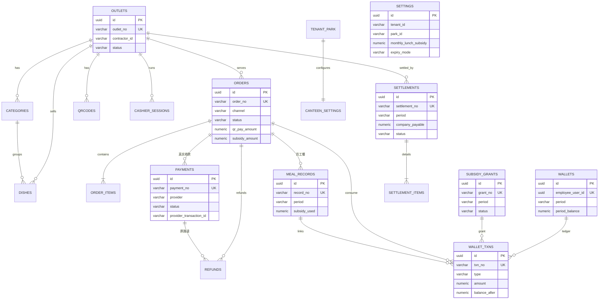

# 园区餐厅管理（食堂承包经营）模块 — 数据模型

> 所属模块：`canteen`（园区餐厅管理 / 食堂承包经营）
> 当前阶段：规划设计（可直接据此写 migration）
> 表名/字段/状态值严格对齐冻结基线第 4、5 节。

---

## 0. 通用约定

- 所有表继承 `apps/api/src/shared/entities/auditable.entity.ts` 的 `AuditableEntity`，自带：
  `id uuid PK`、`tenant_id uuid`、`park_id uuid`、`create_by uuid`、`create_time timestamptz`、`update_by uuid`、`update_time timestamptz`、`is_deleted boolean default false`、`version int default 0`（乐观锁）、`remark text null`。
  下文每张表**只列业务字段**，不重复列基线列。
- 表名前缀 `biz_canteen_`，列名 snake_case，TypeORM 装饰器；PostgreSQL。
- **金额一律 `numeric(12,2)`，单位元**；币种 `currency varchar(3) default 'CNY'`。
- 软删：`is_deleted`；复合索引一般以 `(tenant_id, park_id, is_deleted, ...)` 开头。
- 所有写库操作在事务内；消费核销行锁 `SELECT ... FOR UPDATE` + `version` 乐观锁双保险；余额类字段 `CHECK (col >= 0)`。
- 单号由 code-rules 生成；字典（meal_period/provider/status）走 dicts。

---

## 1. biz_canteen_outlets — 餐厅/档口

| 列名 | 类型 | 可空 | 默认 | 含义 |
|---|---|---|---|---|
| outlet_no | varchar(32) | 否 | — | 档口编号（code-rules，租户内唯一） |
| name | varchar(128) | 否 | — | 餐厅/档口名称 |
| outlet_type | varchar(16) | 否 | — | 堂食/档口（dict） |
| contractor_id | varchar(64) | 否 | — | 承包方（party/商户 id） |
| location | varchar(256) | 是 | null | 位置描述 |
| business_hours | varchar(128) | 是 | null | 营业时间描述 |
| status | varchar(16) | 否 | 'open' | open/suspended/closed |
| manager_user_id | uuid | 是 | null | 餐厅管理员（员工 user） |

- PK：`id`。逻辑外键：`contractor_id → party`、`manager_user_id → users`。
- 唯一键：`uk(tenant_id, outlet_no)`。
- 索引：`(tenant_id, park_id, contractor_id)`、`(tenant_id, park_id, status)`。
- CHECK：`status IN ('open','suspended','closed')`。

## 2. biz_canteen_categories — 品类

| 列名 | 类型 | 可空 | 默认 | 含义 |
|---|---|---|---|---|
| outlet_id | uuid | 否 | — | 所属档口 |
| name | varchar(64) | 否 | — | 品类名 |
| sort_order | int | 否 | 0 | 排序 |
| status | varchar(8) | 否 | 'on' | on/off |

- PK：`id`。逻辑外键：`outlet_id → biz_canteen_outlets.id`。
- 索引：`(tenant_id, park_id, outlet_id, sort_order)`。
- CHECK：`status IN ('on','off')`。

## 3. biz_canteen_dishes — 餐品

| 列名 | 类型 | 可空 | 默认 | 含义 |
|---|---|---|---|---|
| outlet_id | uuid | 否 | — | 所属档口 |
| category_id | uuid | 否 | — | 所属品类 |
| dish_no | varchar(32) | 否 | — | 餐品编号 |
| name | varchar(128) | 否 | — | 餐品名 |
| price | numeric(12,2) | 否 | — | 售价（元） |
| image_file_id | uuid | 是 | null | 图片文件（files） |
| unit | varchar(16) | 否 | '份' | 单位 |
| barcode | varchar(64) | 是 | null | 条码 |
| daily_stock | int | 是 | null | 每日库存（null=不限） |
| sold_count | int | 否 | 0 | 当日已售 |
| need_booking | boolean | 否 | false | 是否需预订 |
| status | varchar(16) | 否 | 'off_shelf' | on_shelf/off_shelf |
| shelf_time | timestamptz | 是 | null | 上架时间 |
| unshelf_time | timestamptz | 是 | null | 下架时间 |

- PK：`id`。逻辑外键：`outlet_id→outlets`、`category_id→categories`、`image_file_id→files`。
- 唯一键：`uk(tenant_id, outlet_id, dish_no)`。
- 索引：`(tenant_id, park_id, outlet_id, category_id, status)`。
- CHECK：`price >= 0`、`daily_stock >= 0`、`sold_count >= 0`、`status IN ('on_shelf','off_shelf')`。

## 4. biz_canteen_orders — 订单

| 列名 | 类型 | 可空 | 默认 | 含义 |
|---|---|---|---|---|
| order_no | varchar(40) | 否 | — | 订单号（code-rules） |
| outlet_id | uuid | 否 | — | 档口 |
| contractor_id | varchar(64) | 否 | — | 承包方（冗余便于聚合） |
| business_date | date | 否 | — | 业务日期 |
| meal_period | varchar(16) | 否 | — | 早餐/午餐/晚餐（dict） |
| cashier_user_id | uuid | 否 | — | 收银员（终端账号） |
| cashier_session_id | uuid | 是 | null | 所属班次 |
| channel | varchar(16) | 否 | — | qr_pay/subsidy/mixed |
| total_amount | numeric(12,2) | 否 | — | 订单总额 |
| discount_amount | numeric(12,2) | 否 | 0 | 优惠额 |
| pay_amount | numeric(12,2) | 否 | — | 应付总额 |
| qr_pay_amount | numeric(12,2) | 否 | 0 | 真实收款部分 |
| subsidy_amount | numeric(12,2) | 否 | 0 | 虚拟核销部分 |
| status | varchar(20) | 否 | 'pending' | pending/paid/completed/cancelled/refunded/partial_refunded |
| paid_time | timestamptz | 是 | null | 支付完成时间 |
| void_time | timestamptz | 是 | null | 撤单时间 |
| void_reason | varchar(256) | 是 | null | 撤单原因 |
| refund_status | varchar(20) | 是 | null | none/full/partial |

- PK：`id`。逻辑外键：`outlet_id→outlets`、`cashier_session_id→cashier_sessions`。
- 唯一键：`uk(tenant_id, order_no)`。
- 索引：`(tenant_id, park_id, outlet_id, business_date)`、`(tenant_id, park_id, status)`、`(tenant_id, contractor_id, business_date)`。
- CHECK：`total_amount>=0`、`pay_amount>=0`、`qr_pay_amount>=0`、`subsidy_amount>=0`、`channel IN (...)`、`status IN (...)`；
  分账一致性：`subsidy_amount + qr_pay_amount = pay_amount`（应用层 + DB CHECK 兜底）。

## 5. biz_canteen_order_items — 订单明细

| 列名 | 类型 | 可空 | 默认 | 含义 |
|---|---|---|---|---|
| order_id | uuid | 否 | — | 所属订单 |
| dish_id | uuid | 否 | — | 餐品（快照来源） |
| dish_name_snapshot | varchar(128) | 否 | — | 餐品名快照 |
| price_snapshot | numeric(12,2) | 否 | — | 单价快照 |
| qty | int | 否 | — | 数量 |
| amount | numeric(12,2) | 否 | — | 小计 |
| category_snapshot | varchar(64) | 是 | null | 品类快照 |

- PK：`id`。逻辑外键：`order_id→orders`、`dish_id→dishes`。
- 索引：`(tenant_id, park_id, order_id)`、`(tenant_id, park_id, dish_id)`。
- CHECK：`qty > 0`、`amount >= 0`。

## 6. biz_canteen_payments — 扫码支付流水（真实收款）

| 列名 | 类型 | 可空 | 默认 | 含义 |
|---|---|---|---|---|
| payment_no | varchar(40) | 否 | — | 支付单号 |
| order_id | uuid | 否 | — | 关联订单 |
| outlet_id | uuid | 否 | — | 档口 |
| provider | varchar(16) | 否 | — | wechat/alipay |
| trade_type | varchar(16) | 否 | 'native' | native/当面付 |
| code_url | text | 是 | null | 二维码串 |
| qr_code_id | varchar(64) | 是 | null | 聚合码 id |
| amount | numeric(12,2) | 否 | — | 支付金额 |
| currency | varchar(3) | 否 | 'CNY' | 币种 |
| status | varchar(16) | 否 | 'pending' | pending/paid/failed/closed/refunded |
| provider_transaction_id | varchar(64) | 是 | null | 支付平台交易号 |
| buyer_payer_id | varchar(128) | 是 | null | 付款方标识（脱敏） |
| paid_time | timestamptz | 是 | null | 支付时间 |
| callback_time | timestamptz | 是 | null | 回调时间 |
| callback_payload | jsonb | 是 | null | 回调原始报文 |
| idempotency_key | varchar(64) | 否 | — | 幂等键 |

- PK：`id`。逻辑外键：`order_id→orders`、`outlet_id→outlets`。
- 唯一键：`uk(tenant_id, payment_no)`；provider 侧部分唯一 `(provider, provider_transaction_id) WHERE status='paid' AND provider_transaction_id IS NOT NULL`。
- 索引：`(tenant_id, park_id, order_id)`、`(tenant_id, park_id, status)`、`(tenant_id, outlet_id, paid_time)`（替代 baseline 的 business_date via paid_time）。
- CHECK：`amount >= 0`、`status IN (...)`。

## 7. biz_canteen_qr_codes — 收款码登记

| 列名 | 类型 | 可空 | 默认 | 含义 |
|---|---|---|---|---|
| outlet_id | uuid | 否 | — | 档口 |
| code_type | varchar(16) | 否 | — | dynamic/static |
| name | varchar(64) | 否 | — | 码名称 |
| payload | text | 否 | — | 码内容/链接 |
| provider | varchar(16) | 是 | null | 对应渠道 |
| status | varchar(16) | 否 | 'active' | active/disabled |
| bound_cashier_user_id | uuid | 是 | null | 绑定收银员 |

- PK：`id`。逻辑外键：`outlet_id→outlets`。
- 索引：`(tenant_id, park_id, outlet_id, status)`。

## 8. biz_canteen_wallets — 员工补贴钱包

| 列名 | 类型 | 可空 | 默认 | 含义 |
|---|---|---|---|---|
| employee_user_id | uuid | 否 | — | 员工 user |
| employee_no | varchar(32) | 否 | — | 工号（冗余） |
| period | varchar(7) | 否 | — | 当前账期 YYYY-MM |
| period_grant | numeric(12,2) | 否 | 0 | 当月已发放 |
| period_consumed | numeric(12,2) | 否 | 0 | 当月已消费 |
| period_expired | numeric(12,2) | 否 | 0 | 当月已清零 |
| period_balance | numeric(12,2) | 否 | 0 | 当月余额 |
| status | varchar(16) | 否 | 'active' | active/frozen |

- PK：`id`。逻辑外键：`employee_user_id→users/hr`。
- 唯一键：`uk(tenant_id, employee_user_id)`（一人一钱包，余额按当前账期）。
- 索引：`(tenant_id, park_id, period)`。
- CHECK：`period_balance >= 0`、`period_grant>=0`、`period_consumed>=0`、`period_expired>=0`；恒等 `period_balance = period_grant - period_consumed - period_expired`（应用层保证）。

## 9. biz_canteen_subsidy_grants — 月度补贴发放单

| 列名 | 类型 | 可空 | 默认 | 含义 |
|---|---|---|---|---|
| grant_no | varchar(40) | 否 | — | 发放单号 |
| period | varchar(7) | 否 | — | 账期 YYYY-MM |
| employee_user_id | uuid | 否 | — | 员工 |
| employee_no | varchar(32) | 否 | — | 工号 |
| plan_amount | numeric(12,2) | 否 | — | 计划发放额 |
| granted_amount | numeric(12,2) | 否 | 0 | 实际发放额 |
| status | varchar(20) | 否 | 'scheduled' | scheduled/granted/partially_consumed/consumed/expired |
| grant_time | timestamptz | 是 | null | 发放时间 |
| expire_time | timestamptz | 是 | null | 清零时间 |
| rule_snapshot | jsonb | 是 | null | 标准/适用人群快照 |

- PK：`id`。逻辑外键：`employee_user_id→users`。
- 唯一键：`uk(tenant_id, employee_user_id, period)`。
- 索引：`(tenant_id, park_id, period, status)`。
- CHECK：`plan_amount>=0`、`granted_amount>=0`、`status IN (...)`。

## 10. biz_canteen_wallet_txns — 补贴账户流水

| 列名 | 类型 | 可空 | 默认 | 含义 |
|---|---|---|---|---|
| txn_no | varchar(40) | 否 | — | 流水号 |
| wallet_id | uuid | 否 | — | 钱包 |
| grant_id | uuid | 是 | null | 关联发放单 |
| period | varchar(7) | 否 | — | 账期 |
| employee_user_id | uuid | 否 | — | 员工 |
| type | varchar(16) | 否 | — | grant(正)/consume(负)/refund(正,回补)/expire(负) |
| amount | numeric(12,2) | 否 | — | 发生额（带符号语义） |
| balance_after | numeric(12,2) | 否 | — | 变动后余额 |
| order_id | uuid | 是 | null | 关联订单 |
| meal_record_id | uuid | 是 | null | 关联用餐记录 |
| operator_user_id | uuid | 是 | null | 操作人 |
| txn_time | timestamptz | 否 | — | 流水时间 |

- PK：`id`。逻辑外键：`wallet_id→wallets`、`grant_id→subsidy_grants`、`order_id→orders`。
- 唯一键：`uk(tenant_id, txn_no)`。
- 索引：`(tenant_id, park_id, employee_user_id, period, type)`、`(tenant_id, park_id, order_id)`。
- 流水**只追加不修改不删除**；红冲用反向 refund 流水。
- CHECK：`balance_after >= 0`。

## 11. biz_canteen_meal_records — 员工用餐记录（结算事实）

| 列名 | 类型 | 可空 | 默认 | 含义 |
|---|---|---|---|---|
| record_no | varchar(40) | 否 | — | 记录号 |
| period | varchar(7) | 否 | — | 账期 |
| business_date | date | 否 | — | 业务日期 |
| meal_period | varchar(16) | 否 | — | 早/午/晚餐 |
| outlet_id | uuid | 否 | — | 档口 |
| employee_user_id | uuid | 否 | — | 员工 |
| order_id | uuid | 否 | — | 关联订单 |
| total_amount | numeric(12,2) | 否 | — | 当餐总额 |
| subsidy_used | numeric(12,2) | 否 | — | 补贴支付部分 |
| qr_pay_amount | numeric(12,2) | 否 | 0 | 混合时自付真实部分 |
| status | varchar(16) | 否 | 'normal' | normal/voided/refunded |

- PK：`id`。逻辑外键：`outlet_id→outlets`、`employee_user_id→users`、`order_id→orders`。
- 唯一键：`uk(tenant_id, record_no)`。
- 索引：`(tenant_id, park_id, period, employee_user_id)`、`(tenant_id, park_id, outlet_id, business_date)`、`(tenant_id, contractor_id, period)`（contractor 经 outlet 冗余/join）。
- CHECK：`total_amount>=0`、`subsidy_used>=0`、`qr_pay_amount>=0`、`status IN (...)`。

## 12. biz_canteen_cashier_sessions — 收银班次/日结

| 列名 | 类型 | 可空 | 默认 | 含义 |
|---|---|---|---|---|
| session_no | varchar(40) | 否 | — | 班次号 |
| outlet_id | uuid | 否 | — | 档口 |
| cashier_user_id | uuid | 否 | — | 收银员 |
| open_time | timestamptz | 否 | — | 开班时间 |
| close_time | timestamptz | 是 | null | 结班时间 |
| opening_float | numeric(12,2) | 否 | 0 | 备用金 |
| qr_pay_total | numeric(12,2) | 否 | 0 | 本班真实收款合计 |
| subsidy_total | numeric(12,2) | 否 | 0 | 本班虚拟核销合计 |
| order_count | int | 否 | 0 | 本班单数 |
| refund_total | numeric(12,2) | 否 | 0 | 本班退款合计 |
| status | varchar(8) | 否 | 'open' | open/closed |
| close_snapshot | jsonb | 是 | null | 结班快照 |

- PK：`id`。逻辑外键：`outlet_id→outlets`、`cashier_user_id→users`。
- 唯一键：`uk(tenant_id, session_no)`。
- 索引：`(tenant_id, park_id, outlet_id, status)`、`(tenant_id, park_id, cashier_user_id)`。
- CHECK：各合计 `>=0`、`status IN ('open','closed')`。

## 13. biz_canteen_refunds — 退款/撤单

| 列名 | 类型 | 可空 | 默认 | 含义 |
|---|---|---|---|---|
| refund_no | varchar(40) | 否 | — | 退款单号 |
| order_id | uuid | 否 | — | 关联订单 |
| payment_id | uuid | 是 | null | 真实收款退款（payments） |
| wallet_txn_id | uuid | 是 | null | 补贴退回（反向流水） |
| type | varchar(24) | 否 | — | void_before_pay/refund_after_pay |
| amount | numeric(12,2) | 否 | — | 退款金额 |
| refund_channel | varchar(16) | 否 | — | original_qr/subsidy |
| status | varchar(16) | 否 | 'pending' | pending/approved/succeeded/failed |
| reason | varchar(256) | 否 | — | 原因 |
| operator_user_id | uuid | 否 | — | 发起人 |
| audit_user_id | uuid | 是 | null | 审核人 |
| finish_time | timestamptz | 是 | null | 完成时间 |

- PK：`id`。逻辑外键：`order_id→orders`、`payment_id→payments`、`wallet_txn_id→wallet_txns`。
- 唯一键：`uk(tenant_id, refund_no)`。
- 索引：`(tenant_id, park_id, order_id)`。
- CHECK：`amount >= 0`、`status IN (...)`。撤单仅允许 order 在 paid 前。

## 14. biz_canteen_settlements — 承包方月度结算单

| 列名 | 类型 | 可空 | 默认 | 含义 |
|---|---|---|---|---|
| settlement_no | varchar(40) | 否 | — | 结算单号 |
| period | varchar(7) | 否 | — | 账期 YYYY-MM |
| outlet_id | uuid | 否 | — | 档口 |
| contractor_id | varchar(64) | 否 | — | 承包方 |
| sales_total | numeric(12,2) | 否 | 0 | 总营业额 |
| qr_pay_total | numeric(12,2) | 否 | 0 | 真实收款合计 |
| subsidy_total | numeric(12,2) | 否 | 0 | 员工餐补消费合计=公司应付基础 |
| refund_total | numeric(12,2) | 否 | 0 | 退款合计 |
| company_payable | numeric(12,2) | 否 | 0 | = subsidy_total − 餐补相关退款净额 |
| status | varchar(16) | 否 | 'draft' | draft/submitted/reconciling/approved/settled/disputed |
| generated_time | timestamptz | 是 | null | 生成时间 |
| submitted_time | timestamptz | 是 | null | 提交时间 |
| reconciled_time | timestamptz | 是 | null | 核对时间 |
| approved_time | timestamptz | 是 | null | 审批时间 |
| settled_time | timestamptz | 是 | null | 付款结账时间 |
| finance_user_id | uuid | 是 | null | 经办财务 |
| settle_evidence_file_id | uuid | 是 | null | 付款凭证（files） |

- PK：`id`。逻辑外键：`outlet_id→outlets`、`settle_evidence_file_id→files`。
- 唯一键：默认按 outlet：`uk(tenant_id, outlet_id, period)`（若按承包方聚合则 `uk(tenant_id, contractor_id, period)`，基线允许二选一，本期取 outlet 维度）。
- 索引：`(tenant_id, park_id, period, status)`、`(tenant_id, contractor_id, period)`。
- CHECK：各金额 `>=0`、`status IN (...)`。

## 15. biz_canteen_settlement_items — 结算/对账明细

| 列名 | 类型 | 可空 | 默认 | 含义 |
|---|---|---|---|---|
| settlement_id | uuid | 否 | — | 所属结算单 |
| biz_date | date | 否 | — | 业务日期 |
| meal_period | varchar(16) | 是 | null | 餐段 |
| order_count | int | 否 | 0 | 单数 |
| qr_pay_amount | numeric(12,2) | 否 | 0 | 当日真实收款 |
| subsidy_amount | numeric(12,2) | 否 | 0 | 当日员工消费 |
| refund_amount | numeric(12,2) | 否 | 0 | 当日退款 |
| source | varchar(16) | 否 | 'order' | order 聚合 / meal_record 聚合 |
| diff_amount | numeric(12,2) | 否 | 0 | 差异额 |
| diff_reason | varchar(256) | 是 | null | 差异原因 |

- PK：`id`。逻辑外键：`settlement_id→settlements`。
- 索引：`(tenant_id, park_id, settlement_id)`、`(tenant_id, park_id, biz_date)`。
- CHECK：金额 `>=0`。

## 16. biz_canteen_status_logs — 状态变更日志

| 列名 | 类型 | 可空 | 默认 | 含义 |
|---|---|---|---|---|
| entity_type | varchar(16) | 否 | — | order/payment/settlement/grant/refund |
| entity_id | uuid | 否 | — | 实体 id |
| before_status | varchar(20) | 是 | null | 变更前 |
| after_status | varchar(20) | 否 | — | 变更后 |
| action | varchar(32) | 否 | — | 动作 |
| reason | varchar(256) | 是 | null | 原因 |
| operator_user_id | uuid | 是 | null | 操作人 |
| operator_name | varchar(64) | 是 | null | 操作人名快照 |
| op_time | timestamptz | 否 | — | 操作时间 |

- PK：`id`。索引：`(tenant_id, park_id, entity_type, entity_id, op_time)`。
- 追加写、不可改，作为审计留存。

## 17. biz_canteen_settings — 租户/园区可配置设置（M0 扩展表）

> 为满足“可配置参数”要求，在冻结 16 表之外新增本表（Organizer 已批准）。tenant/park 维度单行配置。

| 列名 | 类型 | 可空 | 默认 | 含义 |
|---|---|---|---|---|
| monthly_lunch_subsidy | numeric(12,2) | 否 | 300.00 | 月度午餐补贴标准（元/人） |
| grant_day | int | 否 | 1 | 每月发放日（1–28） |
| expiry_mode | varchar(16) | 否 | 'last_day' | 过期模式：last_day / fixed_day |
| expiry_day | int | 是 | null | fixed_day 模式下的宽限日 |
| expiry_time | varchar(8) | 否 | '23:59' | 过期时点（HH:mm） |
| eligible_rule | jsonb | 否 | {"employee_type":"regular","status":"active"} | 适用人群规则（默认在岗正式员工） |
| funds_company_account | bool | 否 | true | 二维码真实收款是否进公司统一账户 |
| settlement_day | int | 否 | 1 | 每月结算日（1–28） |
| management_fee_enabled | bool | 否 | false | 是否启用管理费扣减 |
| management_fee_rule | jsonb | 是 | null | 管理费规则（费率/阶梯） |

- PK：`id`。唯一键：`uk(tenant_id, park_id) WHERE is_deleted = false`。
- CHECK：`monthly_lunch_subsidy >= 0`、`grant_day BETWEEN 1 AND 28`、`settlement_day BETWEEN 1 AND 28`、`expiry_mode IN ('last_day','fixed_day')`。
- 读取时若库中无记录，由 `CanteenSettingsService.getSettings` 返回默认值兜底；写回用 `upsertSettings`。

---

## ER 图（实体关系，mermaid）

## 并发、事务与幂等

- **消费核销并发**：虚拟结账事务内对 `biz_canteen_wallets` 目标行 `SELECT ... FOR UPDATE` 行锁，校验 `period_balance >= 应付`；同时利用 `version` 乐观锁（AuditableEntity 自带）兜底双写冲突；DB 层 `CHECK (period_balance >= 0)` 为最后防线，杜绝超扣/余额为负。
- **支付回调幂等**：以 `provider_transaction_id`（部分唯一）+ `idempotency_key` 双重去重；重复投递直接确认，不重复入账、不重复推进订单。
- **写接口幂等**：所有写接口要求 `Idempotency-Key`（见 api.md），下单/退款/发放/结算推进均按幂等键去重。
- **事务边界**：下单核销、退款红冲、补贴发放/清零、结算状态推进均为单事务；跨表一致性（order + meal_record + wallet_txn + wallet/grant）在同一事务提交。
- **状态日志**：订单/支付/结算/发放/退款每次状态迁移写 `biz_canteen_status_logs`，追加不可改，审计留存。
