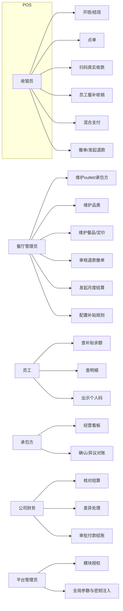
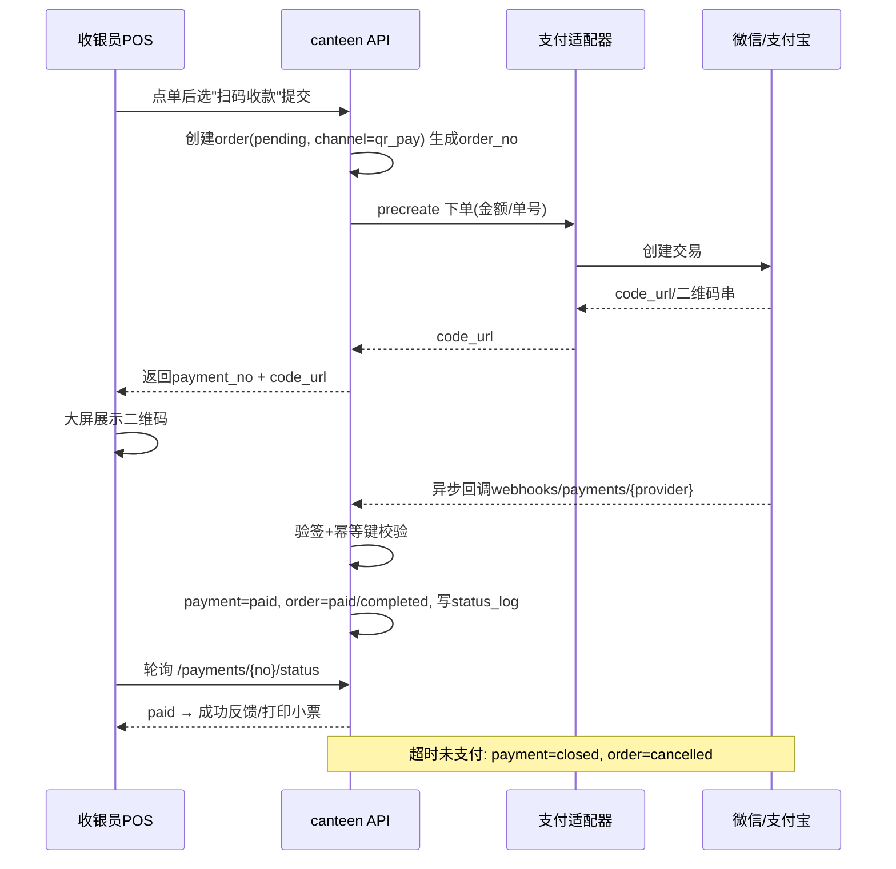
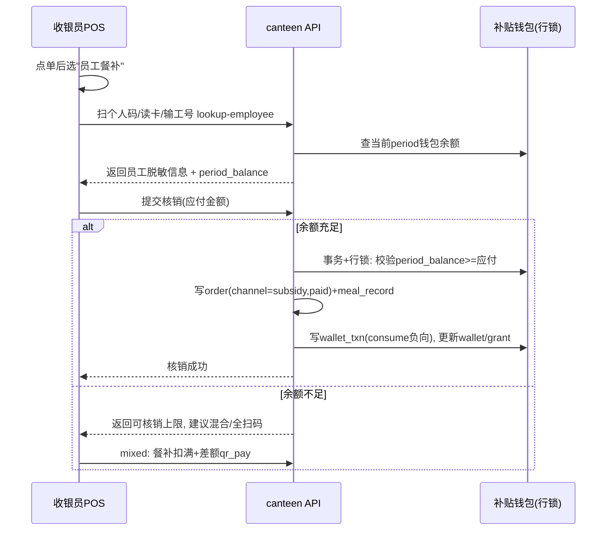
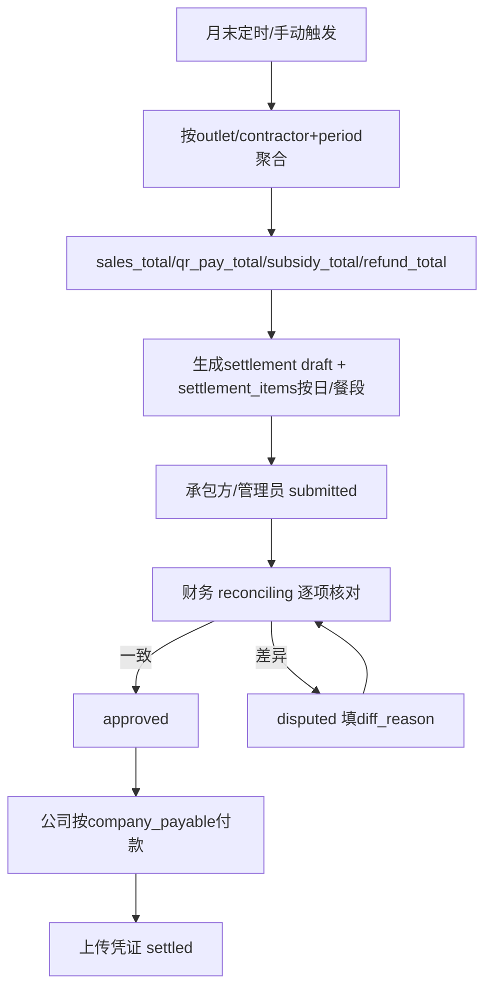
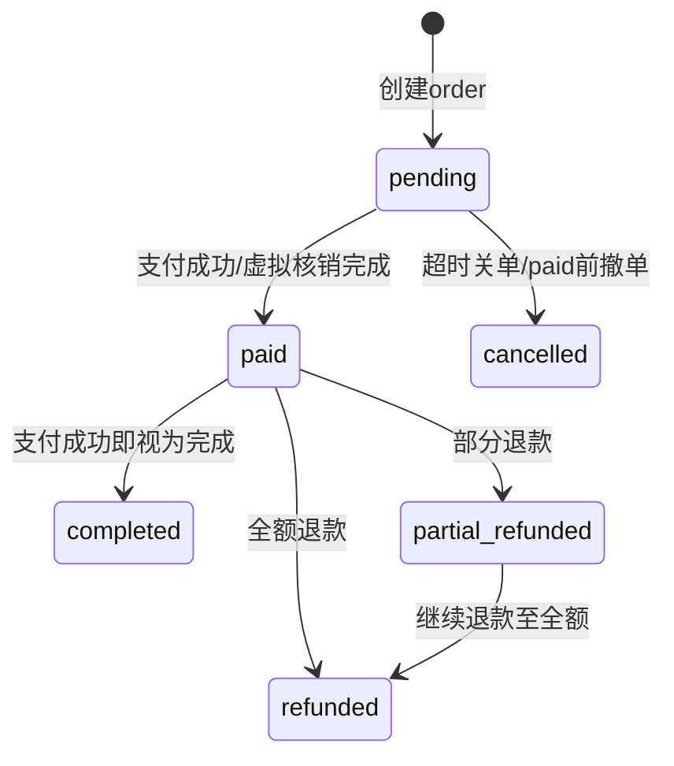
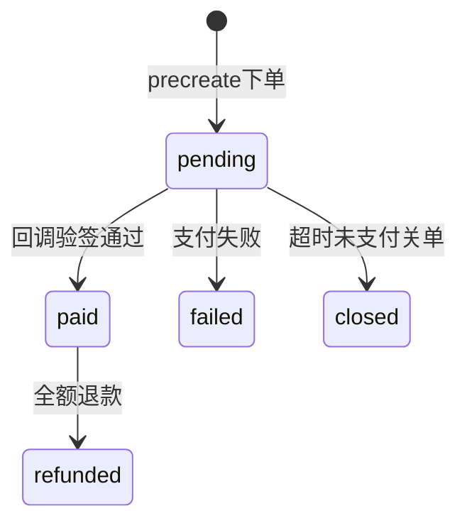
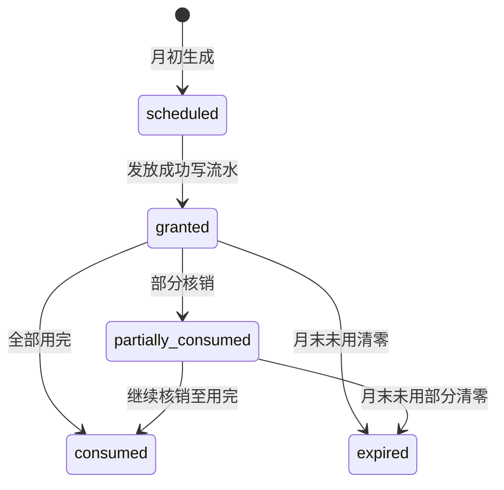
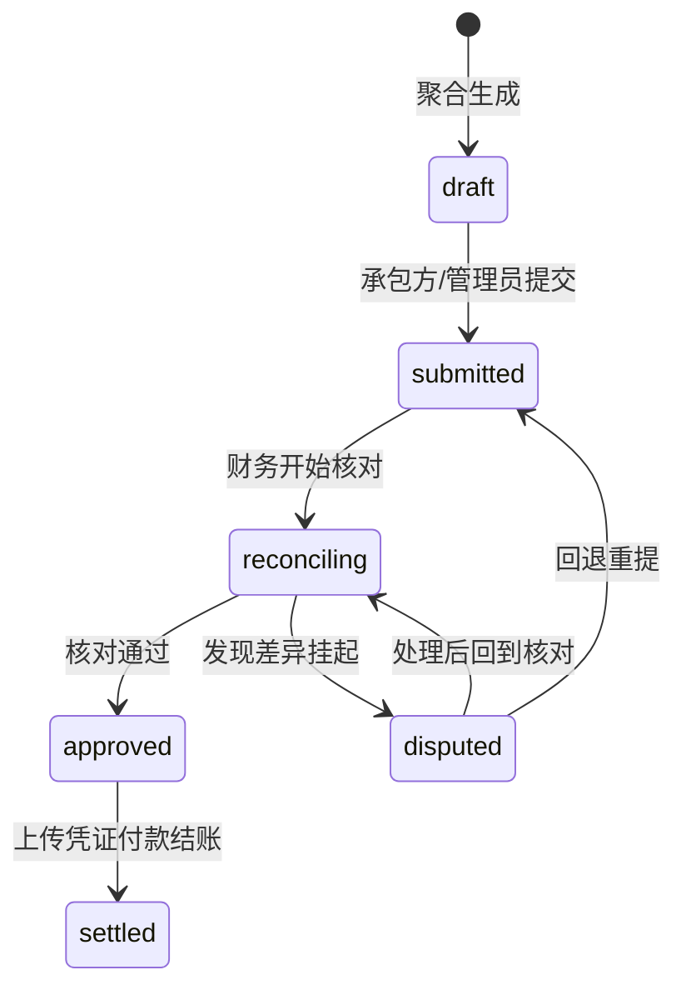
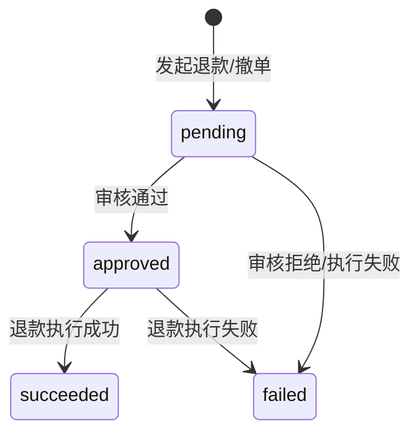

# 园区餐厅管理（食堂承包经营）模块 — 需求规划

> 所属模块：`canteen`（园区餐厅管理 / 食堂承包经营）
> 当前阶段：规划设计（需求与业务规则确认，不含生产代码）
> 术语、状态值、表名、权限前缀与冻结基线一致。状态机与字段定义见 data-model.md，接口见 api.md，权限点见 permissions.md。

---

## 1. 业务背景

园区餐厅为**公司自建资产、对外承包经营**：公司持有餐厅房产与设备，引入外部承包方（Contractor）负责后厨出品与现场服务；公司不直接经营菜品，而是统一收银、统一对账、按月与承包方结算。

业务上存在两类资金：

- **真实收款**：外来访客、未享受补贴人员、以及补贴不足时的差额，通过扫描二维码（微信 Native / 支付宝当面付）支付，发生真实资金流转，默认进入公司统一收款账户。
- **虚拟结账（员工餐补）**：公司向员工按月发放午餐补贴，补贴只存在于员工个人虚拟钱包中，员工就餐时在虚拟账户内核销，**不发生真实资金**。

公司的核心诉求是：现场收银顺畅（高峰排队短）、员工补贴规则清晰可控（不流失、不套现、不超发）、与承包方的月度对账有据可依、资金归集口径明确不重复付款。

### 1.1 核心业务目标

| 目标 | 度量 |
|---|---|
| 现场收银短路径 | 点餐→收款 ≤3 步；单笔结账目标 ≤40 秒 |
| 补贴合规 | 吃则扣/不吃月末清零；余额恒 ≥0；并发不超扣 |
| 分账清晰 | 真实收款与虚拟核销可逐单区分、可逐笔对账 |
| 结算可审计 | 月末 settlement 由订单/meal_record 聚合生成，差异可挂起追溯 |

## 2. 角色与职责

| # | 角色 | 代码 | 职责 |
|---|---|---|---|
| 1 | 平台管理员 | platform-admin | 开通 `canteen` 模块、租户/园区级参数配置（补贴标准、清零时点、归集口径）、全部管理权限 |
| 2 | 餐厅管理员 | canteen-admin | 餐厅/档口与承包方绑定、品类/餐品上架下架与定价、库存、订单与流水查询、退款/撤单审核、班次日结、发起结算 |
| 3 | 收银员 | canteen-cashier | POS 触摸屏点单、扫码真实收款、员工餐补核销、查本班次流水、受限发起撤单/退款（受审核约束） |
| 4 | 承包方 | canteen-contractor | 查看本 outlet/本承包方的经营、销售、员工消费数据；发起或确认月度对账 |
| 5 | 员工 | employee | 个人中心查看当月补贴额度/已用/剩余/到期、发放与消费明细、出示个人码、参与虚拟结账 |
| 6 | 公司财务 | finance | 复核月度结算单、差异处理、审批、上传付款凭证并结账 |

**数据范围（data-scopes）**：收银员/承包方仅见本 outlet（及归属承包方）数据；财务见公司级（本园区/租户全部 outlet）；平台见全部。详见 permissions.md。

## 3. 用例清单（按角色）

### 3.1 餐厅管理员 canteen-admin
- UC-A1 维护餐厅/档口（outlet）：建档、绑定承包方、设置地点/营业时间、启停（open/suspended/closed）。
- UC-A2 维护品类：新增/编辑/排序/启停。
- UC-A3 维护餐品：建档、定价、上传图片、设置库存/是否预订、上架/下架。
- UC-A4 查询订单与流水、按餐段/业务日期筛选。
- UC-A5 审核退款/撤单（复核收银员发起的退款）。
- UC-A6 收银班次日结复核。
- UC-A7 发起月度结算生成（draft）。
- UC-A8 配置补贴标准与适用人群（rule_snapshot）。

### 3.2 收银员 canteen-cashier
- UC-C1 POS 开班（open session，录入备用金）。
- UC-C2 点单（选品类页签、点餐品加入购物车、数量 +/−、删除整单）。
- UC-C3 扫码真实收款（出码→等待支付→成功反馈→打印小票）。
- UC-C4 员工餐补核销（识别员工→展示余额→扣减核销）。
- UC-C5 混合支付（餐补扣满，差额扫码）。
- UC-C6 查询本人当前班次流水与合计。
- UC-C7 撤单（paid 前）/ 发起退款（paid 后，需审核）。
- UC-C8 结班日结。

### 3.3 员工 employee
- UC-E1 个人中心查看当月补贴额度、已用、剩余、到期日。
- UC-E2 查看发放与消费明细分页。
- UC-E3 出示个人码（被收银员扫描以识别身份）。
- UC-E4 （被动）参与虚拟结账：收银员凭个人码/工号完成核销。

### 3.4 承包方 canteen-contractor
- UC-K1 查看本 outlet 经营看板（营业额、单量、餐品排行）。
- UC-K2 查看本承包方月度销售与员工消费汇总。
- UC-K3 确认/发起月度对账（submitted），对差异提出异议（disputed）。

### 3.5 公司财务 finance
- UC-F1 查看全部结算单与对账明细。
- UC-F2 核对（reconciling）：真实收款对支付平台账单/银行进账，员工消费对 meal_record/补贴核销。
- UC-F3 差异处理：记录 diff_reason，挂 disputed 或回退。
- UC-F4 审批通过（approved）、上传付款凭证并付款结账（settled）。

### 3.6 平台管理员 platform-admin
- UC-P1 模块授权（saas-modules 开通 `canteen`）。
- UC-P2 全局参数：补贴标准/账期、清零时点、资金归集口径、支付 provider 配置注入（经 env/密钥管理）。
- UC-P3 审计与全量查询。

### 3.7 用例图（mermaid）



## 4. 端到端流程

### 4.1 二维码真实收款（POS）



要点：下单→支付适配器下单→出码→顾客支付→异步回调验签幂等→POS 轮询→超时关单。不内置真实密钥，配置经 env/密钥管理。

### 4.2 员工餐补虚拟结账



### 4.3 补贴发放与月末清零

```mermaid
flowchart TD
  A[每月初定时任务] --> B[按rule_snapshot筛适用在岗员工]
  B --> C[生成grant scheduled]
  C --> D[事务: grant→granted, 写wallet_txn(grant正向)]
  D --> E[钱包period_grant+=额度, period_balance初始化]
  E --> F[当月员工就餐: consume负向核销]
  F --> G[每月末定时任务]
  G --> H[遍历当月grant未用余额]
  H --> I[写wallet_txn(expire负向), period_balance=0]
  I --> J[grant→expired, 清零留痕]
  J --> K[不结转次月/不兑现/不找零]
```

### 4.4 承包方月末对账结算



### 4.5 退款/撤单日结

```mermaid
flowchart TD
  A[收银员发起] --> B{订单状态?}
  B -->|pending 未支付| C[撤单void_before_pay: order=cancelled]
  B -->|paid 已支付| D[退款refund_after_pay]
  D --> E{退款渠道}
  E -->|真实收款| F[调支付适配器原路退: payment→refunded]
  E -->|虚拟核销| G[写反向wallet_txn(refund), 钱包回补]
  F --> H[refund单 succeeded, order→partial_refunded/refunded]
  G --> H
```

## 5. 核心业务规则

### 5.1 补贴规则（强约束）
- **按月发放**：每月初按规则批量生成 grant（scheduled→granted），适用人群/标准以 rule_snapshot 冻结。
- **吃则扣**：员工就餐虚拟结账时当场从 period_balance 扣减，写 consume 流水。
- **不吃月末清零**：月末定时任务将未用余额 expire，period_balance=0，写 expire 流水。
- **不累积、不兑现、不找零**：余额不结转次月，不可提现，不可找零给员工。
- **余额不可为负**：CHECK `period_balance >= 0`；核销前事务内行锁校验，并发不超扣（乐观锁 version 兜底）。

### 5.2 分账规则
- 每笔订单记录 `channel`（qr_pay/subsidy/mixed）、`qr_pay_amount`（真实收款）、`subsidy_amount`（虚拟核销）。
- 虚拟结账不创建真实支付流水，不进 `biz_canteen_payments`；真实收款才写 payment。
- 补贴是独立虚拟台账，**与真实资金分账**，不直接计入应收（参考 leasing 财务范式但独立）。

### 5.3 承包方结算规则
- 结算凭**员工消费结果**（meal_record / 补贴核销 subsidy_total）作为公司对承包方的主要应付。
- `company_payable = subsidy_total − 餐补相关退款等净额`（公司就员工消费应付承包方）。
- **资金归集口径（默认）**：二维码真实收款进公司统一收款账户，结算时一并划付承包方（扣减平台/管理费规则另配）；若真实收款直接进承包方账户，则在结算中单列、不重复付。

### 5.4 退款/撤单规则
- 撤单（void）仅允许 paid 之前（pending→cancelled）。
- paid 后原路退：二维码退款走支付平台（payment→refunded）；餐补退回虚拟账户并写反向 refund 流水（钱包流水只追加，红冲用反向流水）。

## 6. 状态机（冻结状态值）

### 6.1 订单 Order


### 6.2 扫码支付 Payment


### 6.3 补贴发放 Grant


### 6.4 结算 Settlement


### 6.5 退款 Refund


## 7. 非功能性要求与强制约束

### 7.1 前端界面策略（强制约束，按两类区分）
规范依据 `docs/frontend-ui-standards.md`；达标基线页 `apps/web/app/robots/cleaning/page.tsx`。

**A 类：表单/管理后台类界面——必须统一遵循全局 Design System（@jinhu/ui 原语）**
- 适用：餐品与品类管理、订单/流水列表、结算与对账、报表、权限配置，以及员工个人中心里的表单、明细、筛选、表格、抽屉。
- 统一使用 PageShell/PageHeader/FilterPanel/ContentCard/ActionGroup/FeedbackNotice/PaginationBar、EmptyState/LoadingState/ErrorState、MetricCard/StatusPill/DataTable/DataTableActions。
- 所有抽屉/弹层使用共享 Drawer 原语族（Drawer/DrawerHeader/DrawerActions/DrawerTabs/DrawerForm/DrawerSection/DrawerFormGrid/DrawerFooter/DrawerDetailGrid/DrawerDetailItem），`onClose` 必传，Esc/遮罩可关闭。
- 样式铁律：禁 inline styles、禁硬编码颜色、禁 Tailwind；不在 `globals.css` 新增页面级选择器或覆盖全局选择器；可复用模式在 @jinhu/ui 用 CSS Modules 实现为 `ds-*`；按钮经 ActionGroup/DataTableActions；复选框用全局 `input[type=checkbox]`；数字输入 onFocus 自动 select。

**B 类：专用作业终端（餐厅触摸屏 POS/收银）——不强制套用后台原语**
- 不要求 POS 使用 PageShell/DataTable 等 ERP/后台原语，也不必在 @jinhu/ui 硬造后台式组件。
- 可直接复用或适配成熟开源 POS/收银终端的原始 UI 与样式（大按钮、点单宫格、购物车/客单、数字键盘、结算页），或做独立现代化设计。
- 以作业效率、触摸可用性、性能为先；仅在品牌色/Logo/必要设计令牌上做轻量统一。
- 各端具体落点见 [architecture.md §8](./architecture.md#8-前端界面策略强制按两类区分)。

### 7.2 其他非功能性要求
- 全程多租户隔离、权限最小化、操作留痕；不内置真实支付商户号/密钥（经 env/密钥管理注入）。
- 高频现场页移动优先、短路径（点餐→收款 ≤3 步）；断网容错提示；POS 高性能（大列表虚拟化按需）。
